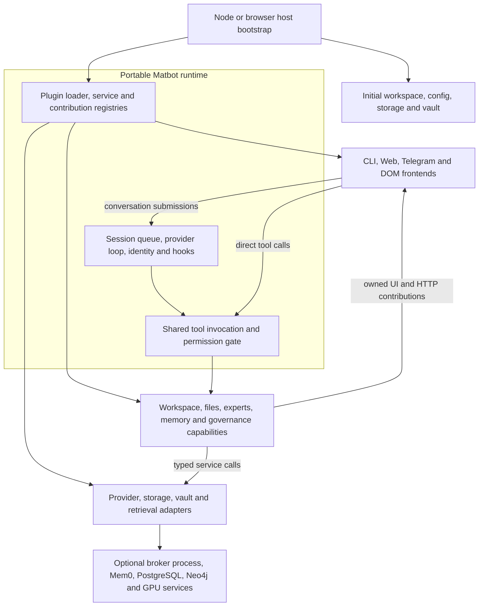

# Architecture And Core Systems

> Part of the [Cortex Local Agent documentation](../README.md).

Cortex is a composition of a small host, a portable runtime, and selected capability
plugins. This page describes the target responsibility boundaries established by
the C1–C14 migration. The [migration guide](plugin-migration.md) maps each candidate
to its implementation and documents compatibility, configuration and validation.

## Target architecture and boundaries

A capability belongs in a plugin when it has an independent reason to be enabled,
a replaceable implementation, a resource lifecycle, or an optional product surface.
Algorithms that share configuration, persistence and correctness invariants stay
together under one owner. Supporting libraries and typed internal adapters remain
appropriate where a separately configured plugin would add no useful boundary.



Arrows describe composition and runtime interactions. Frontends, domain features
and concrete adapters are all plugin families; the diagram does not require a
separate process for each box. External service installation and supervision belong
to the deployment scripts or Windows service host.

### Responsibility boundaries

| Owner | Responsibilities | Boundary |
| --- | --- | --- |
| Host bootstrap (`apps/cli`, `apps/web-bundle`) | Initial argv/env/config loading, workspace selection, provider/module resolution, boot defaults, runtime construction, restart and shutdown. | May construct a plugin package's boot helper before general plugin loading. Ongoing workspace CRUD, settings administration and conversation rendering belong to plugins. |
| Portable runtime (`packages/core`) | Session queue, provider/tool loop, identity, cancellation, streaming, schema/permission enforcement, hooks, loading, service/contribution registries, settings/store facades and quiescence. | Supplies mechanisms and contracts. Domain policy, business workflows and concrete backends have capability owners. |
| Capability plugins | Workspace lifecycle, host files/indexing, skills, cognition, sources/connectors, structured data, workflows, evaluation, graph, experts, configuration and diagnostics. | Own domain validation, state, resources, tools and optional presentation. Depend on typed services instead of importing the executable host. |
| Frontend plugins | Conversation input/output, navigation, provider selection, transport, HTTP/SSE serving and mounting capability UI. | Delegate expert submissions to `ExpertSessions`, attachment interpretation to `AttachmentResolver`, and domain operations to the shared invocation path. HTTP inside the Web frontend remains valid. |
| Concrete adapters and supporting libraries | LLM protocols, file services, persistence, vaults, memory sources, embeddings, reranking, source acquisition and semantic assistance. | Implement portable contracts using declared platform capabilities. Shared parsing/path/HTTP helpers do not need their own plugin lifecycle. |
| Deployment/supervisor | Install/build, Docker startup, Windows service management and external process ownership. | Health contributors report capability availability. They do not acquire general process-control authority. |

`MatbotRuntime` contains the fixed operations and registries. `MatbotServices`
contains replaceable services, and `MatbotMachine` combines them for a plugin's
`setup()`. See the [plugin API](../local-agent/matbot/packages/core/plugin-api/src/plugin.ts)
and the [Matbot runtime overview](../local-agent/matbot/docs/ARCHITECTURE.md).

### Contracts and dependency direction

| Boundary | Contract and owner | Consumers |
| --- | --- | --- |
| Workspace lifecycle | `WorkspaceManager`, immutable `WorkspaceContext`, deletion participants in `workspace-manager-types`; implementation in `workspace-manager-node`. | Host bootstrap, `workspace-admin`, RAG and workspace-scoped memory adapters. |
| Host files and indexing | `HostFileAccess` and `FileIndex` in `file-services-types`; selected local or remote implementation. | File tools, retrieval contributors and optional HTTP listeners. |
| Multiple contributions | `ContributionRegistry` in the plugin API; `webui`, `http`, `configuration`, `retrieval` and `health` shapes in `capabilities-types`. | Frontend, configuration, federation and diagnostics plugins enumerate contributions by owner and lifetime. |
| Retrieval and memory writes | `RetrievalFederation` and one federated `KnowledgeIndex`; a separately selected `MemoryWriteSink`. | `contextual_search`, knowledge consumers and memory producers. Writes go to the selected sink. |
| Expert and attachment operations | `ExpertSessions`, expert definition/knowledge factories, and workspace `AttachmentResolver`. | HTTP/browser composer flows, expert tools and the runner's ephemeral input support. |
| Persistence and secrets | Existing `StorageBackend`, `Store`, `FileStore`, `PluginSettings` and `Vault` interfaces. | Capability state owners; configuration administration invokes contributors rather than editing arbitrary namespaces. |

The target dependency direction is host composition → concrete plugin/adapters →
portable contracts and shared libraries. Consumers use contract packages and fresh
service lookup, or `mounted.consume()` for derived state. No package may depend on
`apps/` for its domain implementation. Runtime-neutral modules must stay free of
Node filesystem/process APIs; platform entry points declare `matbotRuntime` and
keep Node imports out of the browser graph. Existing Node adapters still accept
environment configuration at their construction boundary.

Compatibility exports in `core/tool-plugin` and `core/runner/src/single-turn.ts`
remain for existing callers. The optional `runtime-admin` and `model-consultation`
plugins own the corresponding product tools. Compatibility exports are not a
reason to add new domain behavior to the runtime.

### Authorization and lifecycle

Model tool calls and direct HTTP/browser tool calls share
[`executeToolInvocation`](../local-agent/matbot/packages/core/runner/src/tool-invocation.ts).
It validates input, evaluates permissions, carries session/provider/principal
context, applies call/result hooks and output limits, and propagates cancellation.
The host installs a frozen invocation policy before plugins activate; a missing
policy fails closed for host-bound direct calls. Noninteractive calls requiring
consent return `approval_required`. File-tool `approved: true` requests runtime
consent; the flag itself cannot supply that consent.

Domain services retain their own resource checks: filesystem policy at file
access, deletion reservations at workspace management, and evidence/publication
rules inside RAG. Trusted in-process plugins can call services directly; the
plugin registry is an ownership boundary, not a sandbox. Legacy approval-bearing
broker HTTP clients remain responsible for obtaining consent, as described in the
[compatibility contract](plugin-migration.md#invocation-ownership-and-removal).

There is one active owner per singleton service, while multi-provider features
use contribution collections. Registrations carry an owner, identity and abort
signal. Failed setup/unload removes contributions and tools, aborts their
lifetimes and calls teardown. Plugins must close their own watchers, queues,
requests and other resources. Core swappable proxies follow replacements;
captured arbitrary service objects require fresh lookup or mount observation.
Explicit composition order remains necessary; the loader has no dependency solver.

Feature owners supply their UI modules and fragments. The shared frontend mounts
navigation and panels, removes them and cancels pending UI tool requests on unload,
and returns to chat if an open feature disappears. Registered HTTP routes are
restricted to `/api/...` and reject identity/method/path collisions. A plugin route
that exposes a tool operation delegates to the same invocation gate.

### State and consistency boundaries

The installation workspace registry is separate from workspace data. Workspace
selection happens before plugin loading, and `WorkspaceContext` describes the
configuration actually running. A switch requests a host restart. Deletion
reserves participating resource owners before registry/filesystem mutation; RAG
purges its own derivatives. Pending cleanup remains visible for operator follow-up.

Workspace files, configured RAG folders and the host file corpus have distinct
scopes. Uploads are workspace artifacts; attaching one explicitly supplies
ephemeral prompt context. Host-index results remain subject to current configured
root/path policy even when the index is accessed in process. Memory and RAG queries
carry the active workspace identity.

Workspace RAG retains one collection → document → section → passage pipeline.
Immutable original passages supply evidence; semantic summaries route retrieval.
Reconciliation retains the prior publication when discovery or ingestion is
incomplete. Publication and GC share ownership, protecting active/staging references
and applying global-reference, grace-period and managed-storage rules. Expert
source factories and RAG embedding/repository/source/semantic adapters are initially
internal modules: replacing a backend requires coherent generations and a drain or
restart, rather than an arbitrary mid-query swap.

## Deployment and execution flow

The [capability profile](../local-agent/matbot/apps/cli/src/capability-profiles.ts)
composes the configured plugin list. `CORTEX_CAPABILITY_PROFILE` overrides YAML
`capabilityProfile`; the default is `standard`.

| Profile | Capability composition | Process boundary |
| --- | --- | --- |
| `standard` | Standard capability set plus configured plugins; local file services and federated retrieval. | File-index and file-broker run in process. External RAG/memory services are separate dependencies when selected. |
| `compatibility` | Standard product capabilities with explicitly selected remote file adapters. | Launchers retain broker/index HTTP processes for existing clients. |
| `minimal` | Configured plugins, host workspace bootstrap and the CLI frontend when interactive mode needs it. | No implicit administration tools, capability panels, broker/index processes or Docker startup. Selected plugins can still require external services. |

| Endpoint | Default URL | When present |
| --- | --- | --- |
| Cortex WebUI | `http://localhost:19778` | The Node Web frontend is loaded. |
| File index HTTP | `http://localhost:8877` | Compatibility deployment or an explicitly selected HTTP listener. |
| File broker HTTP | `http://localhost:8878` | Compatibility deployment or an explicitly selected HTTP listener. |
| Mem0 API | `http://localhost:8888` | A separately deployed Mem0 service used by its adapter. |

Startup flow:

1. The launcher checks install/build state and applies the selected process profile.
   Standard/compatibility retain the external Docker stack unless skipped;
   compatibility also starts broker/index HTTP services.
2. The Node host resolves the initial config and installation registry, selects the
   actual workspace config/secrets, and creates boot storage/vault defaults.
3. The host installs identity, invocation policy and workspace context/bootstrap,
   loads provider adapters and composes capability plugins in explicit order.
4. Each plugin registers its owned tools, services, hooks and contributions.
   Frontends discover current capabilities; later changes arrive through lifecycle
   notifications. Choosing a profile does not rewrite every workspace YAML.
5. The browser mounts the shared chat shell and installed feature contributions.
   Read-only provider-name discovery works without the administration plugin.
   Diagnostics enumerate selected capabilities rather than requiring fixed ports.

Per-turn and direct-operation flow:

1. A frontend submits a conversation to the per-session runner. Selected attachments
   are resolved by the workspace capability for ephemeral injection.
2. The runtime applies hooks/system context and calls the chosen provider adapter.
   RAG and memory capabilities supply their configured context/retrieval behavior.
3. Model tool requests pass through shared invocation before reaching a capability.
   Direct UI tool requests enter the same gate without requiring a model decision.
4. Capability tools call typed services; result hooks, output limits, traces and
   streamed events apply at the invocation boundary. The runner persists the
   conversation and continues the provider loop as needed.
5. Expert composer submissions use `ExpertSessions` for busy-state handling,
   session appends and shared invocation of `expert_panel`; transports adapt the
   operation rather than owning expert-review semantics.

Persistence is deliberately split:

| Data | Scope | Location |
| --- | --- | --- |
| Workspace registry | Whole Cortex installation | `local-agent\matbot\cortex-workspaces.json` |
| Provider/plugin config | One Cortex workspace | that workspace's `matbot.yaml` |
| Provider secrets | One Cortex workspace | that workspace's `.env` |
| Sessions, files, stores, memories, skills | One Cortex workspace | that workspace's `.data` |
| Source registry records, versions, health events, and access events | One Cortex workspace through Matbot stores | `sources`, `source_versions`, `source_health_events`, `source_access_events` |
| Traces, spans, evaluation suites/runs/scores, ROI baselines, and verified outcomes | One Cortex workspace through Matbot stores | `observability_traces`, `observability_spans`, `observability_events`, `evaluation_suites`, `evaluation_runs`, `evaluation_scores`, `roi_baselines`, `outcome_events` |
| Per-chat diagnostic timelines | One Cortex workspace, one append-only JSONL file per session | `.data\chat-diagnostics\session-<sha256-prefix>.jsonl` |
| Workspace RAG config | One Cortex workspace | that workspace's `cortex-rag.json` |
| Workspace RAG V2 catalog, lexical evidence, vectors, jobs, and traces | Workspace/context identities within the shared database | Postgres/pgvector `workspace_rag_v2` schema and dimension-specific derivative tables |
| File-index data | Configured host corpus, owned by the selected index service | `local-agent\file-index\data\index.json` or `FILE_INDEX_STORE` |
| Configuration change history | Workspace store, attributed to each contributor | Redacted pre-change records in `configuration_history`; secrets remain in the vault |
| Mem0/Postgres/Neo4j | Docker stack | Docker volumes |

### Per-Chat Diagnostic Logs

`evaluation-observability` also writes a local JSONL timeline for each chat in
`.data\chat-diagnostics`. Files are named from a SHA-256 prefix of the session
id; the complete session and trace identifiers remain in each record. This keeps
directory listings from exposing raw session ids while still making it possible
to correlate one log with the trace inspector or a persisted session.

Each line has a timestamp and one scrubbed observability event. It records the
human request, provider/model request metadata, streamed-response completion
and partial-response details, available versus selected tools, tool input and
result, RAG query/rewritten-query plan, evidence metadata, answerability,
empty-result reason, timings, and terminal/abort/failure state. A provider or
retriever start without an end is evidence of a process interruption; a
`gen_ai.chat.stalled` event means a provider call exceeded 30 seconds. RAG
events explicitly distinguish `empty_evidence`, `insufficient_evidence`, an
unavailable/no-active generation, cancellation, and search errors.

The existing secret scrubber runs before a line is persisted: credential-shaped
fields and values are redacted and nested values are bounded. The logs are still
private workspace state because prompts, model prose, tool payloads, and RAG
queries are intentionally retained for diagnosis. Cortex creates the directory
and deletes only its regular `.jsonl` files older than seven days at startup.

The implemented scale-out design for million-document corpora and exceptional
multi-gigabyte Markdown sources is documented in
[`hybrid-retrieval-architecture.md`](hybrid-retrieval-architecture.md). It
uses streamed versioned ingestion, document/section/
passage retrieval, lexical and dense rank fusion, reranking, range citations,
and tiered lazy embeddings while retaining PostgreSQL/pgvector as the
search plane.

## Core Systems

### Plugin System

Matbot plugins are the main extension mechanism. A plugin can provide one or more
of these things:

- tools callable by the model or by the WebUI HTTP tool endpoint;
- services registered into the runtime, such as `KnowledgeIndex` or
  `WorkspaceRagManager`;
- stores and generated CRUD tools;
- hooks that observe or modify turn behavior;
- provider adapters;
- frontend surfaces such as the WebUI server;
- owned UI/HTTP, retrieval, configuration and health contributions.

Plugins are selected by the active workspace's `plugins:` list and capability
profile. Order matters for required dependencies; optional dependencies use fresh
lookup or mount notifications. Standard composition gives `retrieval-federation`
ownership of `KnowledgeIndex` and registers file, memory and domain retrieval
sources separately. The frontend observes installed owners and can handle features
loading later. Missing required services prevent activation or make the affected
operation unavailable with an explicit error.

There are three common plugin categories in this repository:

| Category | Examples | Pattern |
| --- | --- | --- |
| Capability plugins | `sessions`, `skills`, `triggers`, `cognition`, `workspace` | Add tools, stores, hooks, or runtime services. |
| Retrieval/access plugins | `retrieval-federation`, `memory-local`, `memory-mem0`, `file-index`, `file-broker`, `source-registry`, `connector-fabric`, `context-graph`, `workspace-rag`, `rumsfeld`, `expert-panel` | Provide context, grounded answers, source provenance, connector policy/audit, source-backed graph facts, and policy-aware host-file access. |
| Host/UI plugins | `frontend/web`, `providers/openai-compat` | Connect the runtime to users and models. |

Bundled availability and runtime activation are separate. A plugin becomes active
through profile/configuration selection or explicit runtime loading, and setup can
fail even when its code is present. Use runtime diagnostics and the plugin catalog
to distinguish a missing selection, failed setup and an unavailable dependency.

### Strategic Architecture Progress

The implementation roadmap in `strategic_architecture.md` is being delivered as
ordered, committable slices. Completed build-sequence items:

| Item | Status | Implemented behavior |
| --- | --- | --- |
| Source Registry MVP | Complete | `source-registry` registers `SourceRegistry` and `source_action`; sources have stable ids, versions, freshness state, health state, citation policy, health events, and access events; workspace RAG writes source records for indexed markdown and derived knowledge entries; workspace RAG retrieval hits include source ids, health/freshness state, and citation text. |
| Connector Fabric MVP | Complete | `connector-fabric` registers `ConnectorRegistry` and `connector_action`; it seeds local connector definitions/instances for source registry, workspace RAG, file broker, MCP, and Postgres read-only; action-aware tool bindings classify read/write/admin calls; `toolcall` hooks enforce connector grants before bound tools run; `toolresult` hooks write connector audit events and redact configured sensitive fields. |
| Source Health Monitor Primitives | Complete | `source-registry` now registers `source_health_action`; source health reports are stable store-backed records with stale, expired, degraded, down, denied, and optional unknown-freshness findings; reports include source ids, source version ids, connector health snapshots, warning counts, and critical counts; workspace RAG injects stale/unhealthy warnings in retrieved context and marker data. |
| Structured Data Reasoning MVP | Complete | `structured-data` registers `DataCatalog`, `SqlPlanner`, and `structured_data_action`; semantic table, column, metric, and query-run records are store-backed; deterministic planning emits Postgres SELECT SQL from approved semantic inputs only; validation rejects writes, cross joins, unknown columns, and missing row caps; execution requires an approval token, runs in a read-only transaction with statement timeout, and creates query-result source records. |
| Workflow Run Ledger | Complete | `workflow-governance` registers `WorkflowRegistry`, `WorkflowRunner`, and `workflow_action`; workflow definitions, versions, eval cases, runs, run events, and approvals are store-backed; runs validate typed inputs, resolve evidence source ids and versions, record ordered events, separate proposed and executed actions, support dry-run and shadow modes, request approval gates, and restrict connector tool calls by active workflow allow-lists. |
| Automation Shadow Mode MVP | Complete | `workflow-governance` now stores `workflow_shadow_comparisons`; shadow recommendations are hashed with inputs, evidence, and proposed actions, compared against human labels with deterministic accepted/rejected/mixed/unlabeled outcomes, and exposed through `compare_shadow_result` and `shadow_report` for per-workflow acceptance summaries. |
| Context Graph MVP | Complete | `context-graph` registers `ContextGraph` and `context_graph_action`; entities, relationship assertions, extraction runs, and Neo4j projection operations are store-backed; workspace RAG enqueues deterministic source extraction after source version writes; graph retrieval expands source-backed facts within depth/relationship budgets and filters relationships from denied sources before results reach the model. |
| Workflow Compiler MVP | Complete | `workflow-governance` now registers `WorkflowCompiler`; `workflow_action.compile` converts selected transcript text, input hints, source ids, and tool calls into a validated workflow definition, optional published version, persisted compilation record, and optional dry-run smoke test. |
| Enterprise Expert Panel Upgrade | Complete | `expert-panel` now supports durable structured review records through `expert_panel.review`, `get_review`, and `list_reviews`; reviews link to workflows, workflow runs, dossiers, alerts, investigations, or chats and include structured expert recommendations, confidence, evidence ids, risks, blockers, mitigations, approval checklists, risk registers, consensus, disagreements, and synthesis. |
| Evaluation, Observability, and ROI | Complete | `evaluation-observability` captures agent, model, tool, retriever, guardrail, evaluator, and workflow spans; keeps redacted per-chat JSONL diagnostic timelines for seven days; supports redacted trace inspection and side-effect-free replay; runs versioned deterministic/model-scored regression suites; aggregates retrieval, citation, action, policy, workflow, approval, escalation, cost, latency, and pass-rate metrics; and calculates conservative ROI from baselines and verified business outcomes. |
| Architecture WebUI Panels | In progress | The WebUI exposes dedicated source, governed SQL preview, Workflow Operations Center, context graph entity, expert review-card, and Evaluation & ROI panels. The evaluation panel includes trace waterfall inspection, safe replay, regression-suite execution, evaluation results, operating metrics, and sponsor evidence. Remaining product hardening includes source ownership display, source freshness directly inside graph detail, SQL cost warnings, workflow version diffs, scheduling, and manual expert-review assignment/status editing. |

All current build-sequence items in `strategic_architecture.md` are complete.

### Source Registry

The source registry is Cortex's first strategic architecture primitive. It gives
retrieval and future automation a stable source identity layer instead of relying
only on matched text or file paths.

The `source-registry` plugin registers:

- `SourceRegistry`: a service for writing and querying source records, source
  versions, health events, access events, source health reports, and citation
  metadata.
- `source_action`: a model/UI-facing inspection tool with `list`, `get`,
  `health`, `stale`, `citation`, and `events` actions.
- `source_health_action`: a model/UI-facing health monitor tool with `report`,
  `warnings`, `connectors`, and `reports` actions.

Workspace RAG is the first producer. During markdown ingestion it creates:

- one source record per markdown file, keyed by workspace, connector type, and
  normalized context path;
- one source version per content hash;
- health events for successful reads, read failures, and sources that disappear
  from configured markdown paths.

Workspace RAG retrieval then enriches hits with source id, source health,
freshness, and citation text. The per-turn screen hook includes that metadata in
the injected RAG context and in durable marker data, so a later audit can connect
an answer back to the exact source registry record.

### Source Health Monitor

The source health monitor is implemented as source-registry primitives rather
than a separate runtime dependency. It evaluates current source records into a
stable `source_health_reports` store and keeps early rollout behavior warning
based: retrieval is not blocked only because a source is stale or has unknown
freshness.

`source_health_action` supports:

- `report`: generate and persist a source health report for all sources or one
  workspace.
- `warnings`: return the warning/critical findings from a freshly generated
  report.
- `connectors`: snapshot connector health from `ConnectorRegistry` when
  connector-fabric is loaded.
- `reports`: list persisted source health reports.

Findings are typed as stale, expired, degraded, down, permission denied, or
unknown freshness. Each finding carries the source id, workspace id, connector
type, current health/freshness states, and latest source version id when one is
available. Reports also include connector health snapshots so a source warning
can be correlated with connector outage or degradation.

Workspace RAG consumes the same source health fields during retrieval. When a
retrieved source is stale, expired, degraded, or down, the injected context now
contains explicit warning lines, and the durable `workspace-rag` marker contains
the same structured `sourceWarnings` array consumed by the WebUI architecture
source panels.

### Context Graph

The context graph is Cortex's source-backed entity and relationship layer above
vector retrieval. It keeps extracted graph facts explainable: every relationship
assertion carries the source id, optional source version id, confidence,
extraction method, and optional evidence span.

The `context-graph` plugin registers:

- `ContextGraph`: a store-backed service for `upsertEntity`,
  `assertRelationship`, `searchEntities`, `neighbors`, `pathSearch`,
  `retrieveGraphContext`, extraction-run queries, and projection-operation
  queries.
- `context_graph_action`: a model/UI-facing tool with `list`,
  `upsert_entity`, `assert_relationship`, `extract_source`,
  `search_entities`, `neighbors`, `path_search`, `retrieve`, and
  `projection_log` actions.

The MVP uses four canonical stores:

- `context_graph_entities`;
- `context_graph_relationship_assertions`;
- `context_graph_extraction_runs`;
- `context_graph_projection_ops`.

Workspace RAG is the first producer. After it writes a durable source version
for markdown or derived knowledge content, it calls `ContextGraph.ingestSource`
with the source id, source version id, and extracted text. That work happens in
the ingestion path, not in the hot per-turn chat retrieval hook. Deterministic
extraction currently recognizes markdown headings, emails, issue ids, issue
numbers, URLs, file paths, dates, and `schema.table` names, plus source metadata
such as title, URI, connector type, document type, and known limitations.

Graph retrieval accepts seed terms, seed entity ids, and vector-derived source
ids. It searches candidate entities, expands neighbors within configured depth
and relationship budgets, resolves citations through `SourceRegistry`, and
returns source-backed facts with source health/freshness warnings when present.
Relationships from denied sources are filtered before facts are returned, so an
inaccessible source cannot leak through graph traversal.

Neo4j integration is represented as a durable projection operation log for now.
Each entity or relationship write enqueues an idempotent Cypher merge operation
with workspace id, source id, source version id, confidence, extraction method,
and validity properties. A future projection worker can replay this log against
Neo4j without changing the canonical assertion model.

### Connector Fabric

The connector fabric is Cortex's policy and audit layer around tools that read
or write governed systems. The MVP is store-backed and local-first: it records
connector definitions, connector instances, grants, tool bindings, sync cursors,
health events, and audit events.

The `connector-fabric` plugin registers:

- `ConnectorRegistry`: a service for connector metadata, grants, health, sync
  cursors, policy evaluation, and audit event writes.
- `connector_action`: an inspection/admin tool with `list`, `get`,
  `list_tools`, `grants`, `set_grant`, `set_sync`, `health`, `test_health`, and
  `list_audit` actions.
- `toolcall` and `toolresult` hooks. The `toolcall` hook rejects connector-bound
  tool calls when no active grant allows the effective principal, tool, action,
  capability, and approval policy. The `toolresult` hook records allowed/error
  audit events, extracts returned source ids, hashes input/result payloads, and
  redacts configured sensitive result fields before they are persisted or shown
  to the model.

The seeded local bindings cover the current Cortex data tools:

| Connector instance | Bound tools | Capability handling |
| --- | --- | --- |
| Local Source Registry | `source_action` | Read-only source provenance inspection. |
| Local Workspace RAG | `workspace_rag` | `status`, `get_config`, and `search` are read; configuration actions are write; `reindex_now` is admin. |
| Local File Broker | `file_broker_action` | `health`, `list`, and `read` are read; `write` is write and redacts returned `content`. |
| Local MCP Fabric | `mcp_action`, `mcp__*` | MCP server list is read; add/remove and delegated MCP tools are admin until per-server metadata exists. |
| Local Postgres Read-Only | `structured_data_action` | Catalog and planning reads are read; semantic-model edits and approval are admin; execution is read-only and still requires a query approval token. |
| Local Workflow Governance | `workflow_action` | Validation, inspection, run lists, approval lists, and compilation lists are read; compile, drafts, run starts, dry-runs, and shadow labels are write; approve/reject is admin. |
| Local Context Graph | `context_graph_action` | List/search/retrieve/projection-log actions are read; entity upserts, relationship assertions, and source extraction are write with the `context-graph-write` approval policy. |

The CLI inserts `connector-fabric` into each Cortex workspace before
`workspace-rag`, preserving existing local behavior through wildcard bootstrap
grants while still allowing explicit per-principal deny grants for tests,
operators, and future UI policy controls.

### Structured Data

The structured data layer gives Cortex a governed path for tables, dimensions,
metrics, SQL preview, and approved read-only Postgres execution. It avoids
model-authored arbitrary SQL: callers provide semantic inputs, and deterministic
planner code emits the SQL.

The `structured-data` plugin registers:

- `DataCatalog`: a store-backed service for data connections, tables, columns,
  and metric definitions.
- `SqlPlanner`: a deterministic planner and query-run ledger for semantic SQL
  plans, approval tokens, read-only execution, validation, and result
  provenance.
- `structured_data_action`: a tool with `catalog`, `register_connection`,
  `upsert_table`, `upsert_column`, `upsert_metric`, `plan_query`,
  `validate_sql`, `approve_query`, `execute_query`, and `runs` actions.

The MVP supports Postgres only. Connections are required to be read-only and
default to `${CORTEX_STRUCTURED_POSTGRES_URL}` for approved execution. Query
planning only works from approved metric definitions and approved dimensions or
filters. Generated SQL is validated before preview and before execution:
non-SELECT statements, multiple statements, DDL/DML/session keywords, cross
joins, and missing row caps are rejected.

Every planned query is stored as a `structured_data_query_runs` record with the
SQL hash, semantic inputs, parameters, source ids, status, and principal id.
`approve_query` creates a one-time approval token hash on the run, and
`execute_query` requires the token before opening a Postgres read-only
transaction with a statement timeout. Successful executions create a
`query_result` source record and source version so summaries can cite the query
run, SQL hash, data connection, execution timestamp, row count, and source
tables or metrics.

### Workflow Governance

The workflow governance layer gives Cortex a durable run ledger for governed
automation before adding broad automation execution. It is local-first and
event-sourced: the run record is the current projection, while
`workflow_run_events` is the ordered audit trail.

The `workflow-governance` plugin registers:

- `WorkflowRegistry`: a store-backed service for workflow definitions,
  immutable definition versions, validation, and eval cases.
- `WorkflowRunner`: a run ledger and deterministic state-transition service for
  typed inputs, evidence resolution, proposed actions, approvals, shadow labels,
  and workflow-scoped tool policy.
- `WorkflowCompiler`: a deterministic compiler that turns selected transcript
  text, source ids, input hints, and tool calls into workflow definitions,
  persisted compilation records, and optional dry-run smoke tests.
- `workflow_action`: a tool with `compile`, `get_compilation`,
  `compilations`, `draft`, `validate`, `dry_run`, `start`, `approve`,
  `reject`, `label_shadow_result`, `compare_shadow_result`, `shadow_report`,
  `inspect_run`, `list_runs`, and `list_approvals` actions.

Workflow definitions carry an input JSON Schema subset, source and connector
allow-lists, allowed tools, required evidence, risk level, approval gates,
dry-run default, eval cases, and success metrics. Runs store the definition
version, effective principal, mode, status, typed inputs, evidence source ids,
evidence source-version/citation references, proposed actions, executed action
records, labels, and timestamps.

Dry-run and shadow runs record proposals but do not execute write/admin tools.
Approval-gated and execute-mode runs request approval records for proposed
write/admin actions, stale or unhealthy evidence, low confidence, cost, and risk
gates. A workflow policy hook rejects connector-backed tool calls carrying a
`workflowRunId` when the tool, connector, mode, or approval state falls outside
the active run envelope. Connector audit events now retain `workflowRunId` when
tool inputs include it, linking connector activity back to the workflow ledger.

### Automation Shadow Mode

Automation shadow mode uses the workflow ledger to measure recommendations
before enabling unattended execution. A shadow run records the exact proposal
Cortex would have made, but workflow policy still blocks write/admin tools for
that run mode.

The MVP stores one `workflow_shadow_comparisons` record per compared shadow run.
Each comparison has a stable id derived from the run id, a recommendation hash,
the proposed action ids, tool names, source ids, normalized human labels,
outcome, score, and timestamps. The recommendation hash includes the workflow
id/version, input hash, evidence source ids, and proposed action metadata, so a
later label is tied to the recommendation that was actually shown.

`compare_shadow_result` can attach labels and create or update the comparison.
`label_shadow_result` also writes a comparison as a side effect. Labels are
classified deterministically: accepted-style labels score `1`, rejected-style
labels score `0`, ambiguous or conflicting labels score `0.5`, and unlabeled
runs score `0`. `shadow_report` returns all comparisons plus aggregate counts
and acceptance rates overall and by workflow id.

### Workflow Compiler

The workflow compiler is the promotion path from useful conversation to durable
automation. The MVP is deterministic and review-first: callers provide selected
transcript text, source ids, input hints, tool calls, and sample inputs; the
compiler generates the workflow definition without inventing hidden behavior.

`workflow_action.compile` can return a draft only, publish it through
`WorkflowRegistry`, and optionally start a dry-run smoke test through
`WorkflowRunner`. Each compile writes a `workflow_compilations` record with the
compiler version, input hash, generated definition, validation errors, source
ids, tool names, proposed actions, sample inputs, published workflow id/version,
and dry-run id when present.

The deterministic compiler infers:

- workflow name and purpose from explicit fields or selected transcript text;
- typed input schema from explicit `inputHints` and `{{placeholders}}`;
- required evidence from selected source ids;
- allowed tools and connector instances from supplied tool calls;
- risk level from requested tool capabilities;
- approval gates for write/admin actions, source freshness, high risk, low
  confidence, and cost;
- a dry-run smoke test plus default success metrics.

Model-assisted inference, chat-range selection UI, editable workflow diffs, and
background schedule integration remain future compiler work.

### Memory System

Cortex memory is not a single bucket. It is several layers with different jobs:

| Layer | What it stores | Main tool/service |
| --- | --- | --- |
| Session history | The active conversation and previous conversations. | `sessions` |
| Remembered facts | Explicit durable facts such as names, preferences, and project facts. | `remember_fact`, `remembered_facts_action` |
| Skills | Reusable markdown playbooks and long-term operating knowledge. | `skill_action` |
| KnowledgeIndex | Search interface over skills, Mem0, and file-index results. | `KnowledgeIndex` service |
| Workspace RAG | Markdown files configured for the current workspace. | `workspace_rag` |
| Source registry | Source identity, freshness, health, citations, and retrieval provenance. | `SourceRegistry`, `source_action` |
| Source health monitor | Store-backed health reports and stale/unhealthy source warnings. | `source_health_action`, `source_health_reports` |
| Connector fabric | Connector identity, grants, health, sync cursors, and tool-call audit. | `ConnectorRegistry`, `connector_action` |
| Structured data | Semantic table/metric catalog, query plans, approval tokens, and query-run provenance. | `DataCatalog`, `SqlPlanner`, `structured_data_action` |
| Workflow governance | Workflow definitions, immutable versions, event-sourced run ledgers, approvals, evidence references, shadow labels, shadow comparison records, and compiled workflow drafts. | `WorkflowRegistry`, `WorkflowRunner`, `WorkflowCompiler`, `workflow_action` |
| Context graph | Source-backed entities, relationship assertions, extraction runs, and graph projection operations. | `ContextGraph`, `context_graph_action` |
| Dream-time runs | Memory consolidation audit records. | `dream_time`, `dream_runs_action` |

The "remember my name" flow is the simplest way to understand this:

1. The user says, "Memorize my name: Maciej Zagozda."
2. The `triggers` plugin classifies that message as memory-worthy.
3. The `cognition` plugin runs `remember_fact` as a silent side effect.
4. `remember_fact` extracts the stable fact and writes it to `remembered_facts`.
5. On a later turn, `contextual_search` can search raw `remembered_facts`
   directly, so the name can be recalled before any slower consolidation happens.
6. `dream_time` is a separate consolidation pass that can later merge remembered
   facts into skills when they strongly match a skill.

This separation matters. Storing a fact and recalling a fact are different
operations. A model can fail to recall a name even when the fact exists if it
does not call the retrieval tool or the relevant memory context is not injected.
That is why direct inspection through `remembered_facts_action` is documented in
[Memory and Retrieval](memory-and-retrieval.md).

### Inner Voice

Inner Voice is Cortex's built-in second-opinion pattern for improving an
assistant response. It is part of the `cognition` plugin, but it is not durable
memory and it is not background execution. It is a critique mechanism.

The concept is a two-chamber model:

- `Matbot1` is the normal chat agent: analytical, goal-directed, tool-using,
  and responsible for the final answer.
- `Matbot2` is the constructive critic: it looks for wrong assumptions,
  generic reasoning, missing context, weak framing, and overconfident answers.

The point is not to make one model "think harder." The point is to ask a
different kind of thinker to challenge the first answer. In the best case,
`Matbot2` runs on a different model lineage from the main provider so its
critique is genuinely independent. If no separate provider is configured,
Inner Voice can still fall back to the current turn's provider, but that is a
same-lineage self-critique and is less valuable.

Operationally, the `cognition` plugin seeds an `Inner voice` skill and
registers the `ask_inner_voice` tool. When the skill is used, `Matbot1`
summarizes the user's problem and its draft answer, calls `ask_inner_voice`,
then integrates the critique into one sharper response. The user normally sees
the improved answer, not a transcript of two agents debating.

Inner Voice is best suited to strategic, design, trust, UX, communication, and
other open-ended questions where framing matters. It is a poor fit for narrow
data lookups, SQL/config formatting, or tasks with one straightforward correct
answer. In the trigger system, it acts like an "expert over your shoulder":
it can be loaded when the user asks for deeper thought, challenges an answer,
expresses skepticism, or when an assistant response itself shows signs of an
unresolved anomaly.

### Scheduled And Unattended Actions

Cortex can run scheduled work without an attended browser tab, but the Matbot
Node process must stay alive. The browser is only the control surface. Closing
the browser does not stop an already running Cortex process; stopping the Matbot
process does stop the scheduler.

The built-in scheduling path is the optional `background` plugin. It exposes:

- `background`: starts a prompt in a child Matbot process. With `interval`, it
  creates a recurring schedule.
- `every_action`: lists, suspends, resumes, or cancels recurring schedules.

Recurring schedules are stored in the active workspace and are re-armed when
Cortex starts again. They do not run while the computer is asleep, powered off,
or while the Matbot process is stopped. Missed intervals are not caught up by an
external service; the in-process scheduler resumes after Cortex is running.

Scheduled prompts can use whatever tools are loaded in the same workspace. The
common unattended-action stack is:

| Plugin | What it enables | Notes |
| --- | --- | --- |
| `./packages/plugins/background` | Recurring and detached prompt jobs. | Required for Cortex-managed schedules. |
| `./packages/plugins/http` | Fetch pages, APIs, and remote resources. | Uses plain HTTP fetch; it does not render JavaScript-heavy pages. |
| `./packages/plugins/powershell` | Execute Windows-native PowerShell scripts. | Preferred for Windows command automation. |
| `./packages/plugins/bash` | Execute shell scripts from a scheduled prompt. | Spawns `bash -c`; Windows needs `bash.exe` in PATH, such as Git Bash or WSL. |
| `./packages/plugins/docker-bash` | Execute shell scripts in Docker. | Prefer this for risky or untrusted command automation. |

For native Windows command execution, use the `powershell` tool. The `bash`
plugin is not a PowerShell runner.

To enable Cortex-managed schedules, insert the needed plugins in the active
workspace's `matbot.yaml` before the existing `frontend/web` entry, then restart
Cortex:

```yaml
plugins:
  # existing plugins above...
  - ./packages/plugins/background
  - ./packages/plugins/http
  - ./packages/plugins/powershell
  - ./packages/plugins/bash
  - ./packages/plugins/frontend/web
```

For manual foreground-free use, Cortex can still be started without opening a
browser:

```powershell
.\scripts\run.ps1 -NoBrowser
```

For unattended operation on Windows, install the Cortex service wrapper instead
of supervising `run.ps1` with Task Scheduler. `run.ps1` and
`start-local-agent.ps1` intentionally start Matbot as a hidden child process and
then return; a scheduled task would supervise only the launcher. The service path
uses WinSW and `scripts\run-service.ps1`, which keeps Matbot in the foreground so
the wrapper observes the real long-running process and restarts it if it exits.

```powershell
.\scripts\run.ps1 -NoStart
Start-Process powershell -Verb RunAs -ArgumentList '-NoProfile -ExecutionPolicy Bypass -File "C:\Projects\Cortex\scripts\install-cortex-service.ps1" -Start'
```

The installer downloads WinSW into `local-agent\service` unless `-WinSWExe` is
provided, writes `CortexLocalAgent.xml`, installs the service, and optionally
starts it. Service logs are written under `local-agent\logs\service`.

By default the service is installed under Windows' default service account. If
Docker Desktop, provider keys, `pnpm`, Git Bash, WSL, or mapped/network drives
are only available under your interactive Windows user, change the service Log On
account in `services.msc` or configure secrets in the workspace `.env` files
instead of relying on user-scoped environment variables.

Operate the service with normal Windows service commands:

```powershell
Get-Service CortexLocalAgent
Start-Service CortexLocalAgent
Stop-Service CortexLocalAgent
Restart-Service CortexLocalAgent
```

Uninstall the service from an elevated PowerShell session:

```powershell
.\scripts\uninstall-cortex-service.ps1
```

You can create and manage schedules through chat, or through the WebUI tool HTTP
endpoint while Cortex is running. Example recurring page retrieval:

```powershell
Invoke-RestMethod `
  -Method Post `
  -Uri "http://localhost:19778/tools/background" `
  -ContentType "application/json" `
  -Body '{
    "name": "hourly-page-check",
    "interval": "1h",
    "provider": "openai",
    "output": "scheduled-page-check.md",
    "prompt": "Fetch https://example.com with the http tool, summarize the page status, and write the result to the requested output."
  }'
```

List recurring schedules:

```powershell
Invoke-RestMethod `
  -Method Post `
  -Uri "http://localhost:19778/tools/every_action" `
  -ContentType "application/json" `
  -Body '{"action":"list"}'
```

Suspend, resume, or cancel a schedule:

```powershell
Invoke-RestMethod -Method Post -Uri "http://localhost:19778/tools/every_action" -ContentType "application/json" -Body '{"action":"suspend","id":"<schedule-id>"}'
Invoke-RestMethod -Method Post -Uri "http://localhost:19778/tools/every_action" -ContentType "application/json" -Body '{"action":"resume","id":"<schedule-id>"}'
Invoke-RestMethod -Method Post -Uri "http://localhost:19778/tools/every_action" -ContentType "application/json" -Body '{"action":"cancel","id":"<schedule-id>"}'
```

For deterministic automation, Windows Task Scheduler can still call Cortex tools
directly instead of supervising the Cortex process or asking a model to decide
what to do. For example, a scheduled PowerShell script can call `POST
/tools/http` or `POST /tools/powershell` as long as the Cortex service is already
running. Direct tool calls are non-interactive; they cannot answer prompts that
expect a live UI user.

Security rules for unattended actions:

- Keep the WebUI bound to localhost unless an authentication layer is added.
- Do not expose port `19778` to a LAN or the internet with command tools loaded.
- Run Cortex under a least-privilege Windows account.
- Prefer `docker-bash` for command execution that does not need host access.
- Restrict allowed file roots through `local-agent\config\workspaces.json` and
  `local-agent\config\security-policy.json`.
- Treat `POST /tools/<name>` as powerful local automation, especially when
  `powershell`, `bash`, `docker-bash`, file access, or provider-backed tools are
  enabled.

### Workspace System

A Cortex workspace is a boot-scoped runtime context. It controls:

- provider and model list;
- plugin list;
- workspace-local secrets;
- sessions and files;
- remembered facts and tool stores;
- skills and knowledge;
- workspace RAG folders and Postgres/pgvector index data.

Switching workspaces restarts the Matbot process intentionally. Providers,
plugins, vaults, stores, hooks, and session runners are initialized at boot, so a
true workspace switch needs a fresh runtime.

The default workspace points at `local-agent\matbot\matbot.yaml`. New workspaces
live under `local-agent\matbot\workspaces\<workspace-id>` and receive their own
copy of `matbot.yaml`, `.env`, and `.data`.

### RAG And Retrieval Patterns

Cortex uses several retrieval patterns at once because they solve different
problems:

| Pattern | Scope | Best for | Implementation |
| --- | --- | --- | --- |
| Host file index | Configured host roots | Broad project file search and metadata. | `FileIndex`, `file-index-admin` retrieval contribution, `retrieval-federation` |
| File broker | Configured host roots | Safe host file reads/writes with policy and backups. | `HostFileAccess` or explicit HTTP adapter, `file_broker_action` tool |
| Workspace RAG | One Cortex workspace | Grounding every conversation in selected markdown folders. | `workspace-rag` |
| Source registry | One Cortex workspace | Stable source ids, versions, freshness, health, citations, and retrieval provenance. | `source-registry` |
| Context graph | One Cortex workspace | Source-backed entity relationships and multi-hop graph retrieval with ACL filtering. | `context-graph` |
| Remembered facts | One Cortex workspace | Explicit durable memory such as names and preferences. | `cognition` stores |
| Skills as knowledge | One Cortex workspace | Reusable operating procedures and assistant behavior. | `skills` retrieval contribution, federated `KnowledgeIndex` |
| Expert knowledge roots | One expert definition | Isolated domain expertise. | `expert-panel` |
| Local memory adapter | One Cortex workspace | Persistent knowledge without a remote memory dependency. | `memory-local`, selected `MemoryWriteSink` |
| Mem0 | Shared service with workspace-scoped user ids | External memory service integration without cross-workspace recall. | `memory-mem0`, selected `MemoryWriteSink` |

Standard/compatibility profiles translate legacy `hybrid-knowledge-index` selection
into Mem0 plus file retrieval behind federation without changing the existing Mem0
workspace IDs. The legacy implementation remains available to explicit minimal
deployments. Federation reports failed sources as partial results and keeps memory
writes directed to one selected sink.

The high-level rule is:

- use `workspace_rag` for markdown folders selected for the current workspace;
- use `contextual_search` when the model needs a blended recall layer;
- use `expert_panel` when the user wants different domain perspectives;
- use `contextual_search`/file-index to discover host-file matches, then
  `file_broker_action` to list, read, or write exact host paths;
- use `workspace_action` only for Matbot workspace uploads and generated
  artifacts, not host filesystem files.

### Expert System

The expert panel is a tool-based panel of specialists. Each expert has its own
definition, provider choice, system prompt, and knowledge roots. When asked, the
tool retrieves relevant expert-specific files, runs each expert independently,
and optionally performs a synthesis pass.

This gives three useful behaviors:

- experts can disagree because they are prompted from different perspectives;
- citations stay scoped to each expert's configured files;
- the orchestrator can collate consensus, disagreement, risks, assumptions, and
  a recommendation.

The Enterprise Expert Panel upgrade adds a durable review path on top of the
same isolated expert execution. `expert_panel.review` runs selected experts,
structures each opinion into recommendation, confidence, evidence ids, risks,
blockers, mitigations, and approval checklist fields, then stores an
`expert_panel_reviews` artifact.

Review records can link to:

- decision dossiers;
- workflow definitions;
- workflow runs;
- alerts;
- investigations;
- ordinary chat decisions.

Each review also stores consensus, disagreements, blockers, mitigations, a risk
register, source ids, synthesis text, target metadata, review mode, and review
status. `expert_panel.get_review` and `expert_panel.list_reviews` expose those
records for audit and future review surfaces.

Default business review roles now include finance, legal, security, operations,
data quality, customer impact, compliance, engineering, and change management.
Each role has its own knowledge root and system prompt, preserving the expert
isolation model.

Workflow governance recognizes an `expert_review` approval gate. Compiled
high-risk workflows include this gate by default, and expert reviews can carry
both `workflowId` and `workflowRunId` links so a pre-automation review can be
audited with the run ledger.
