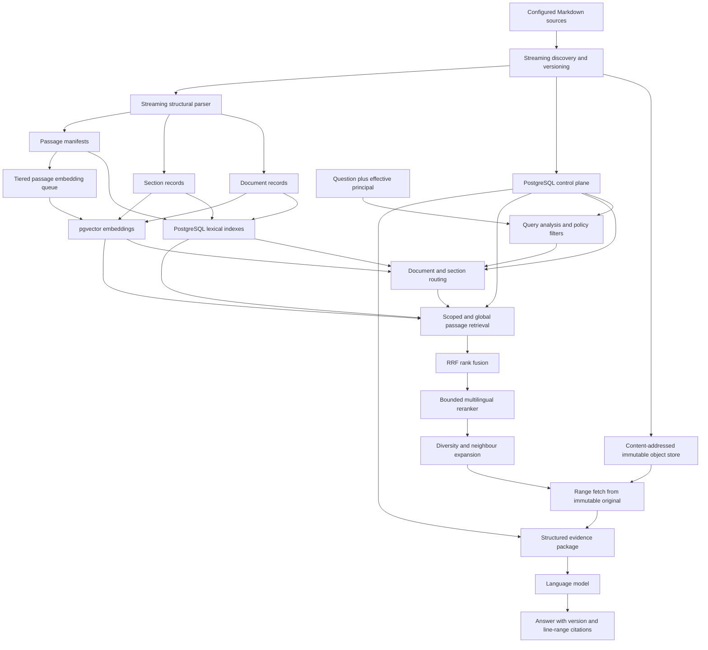
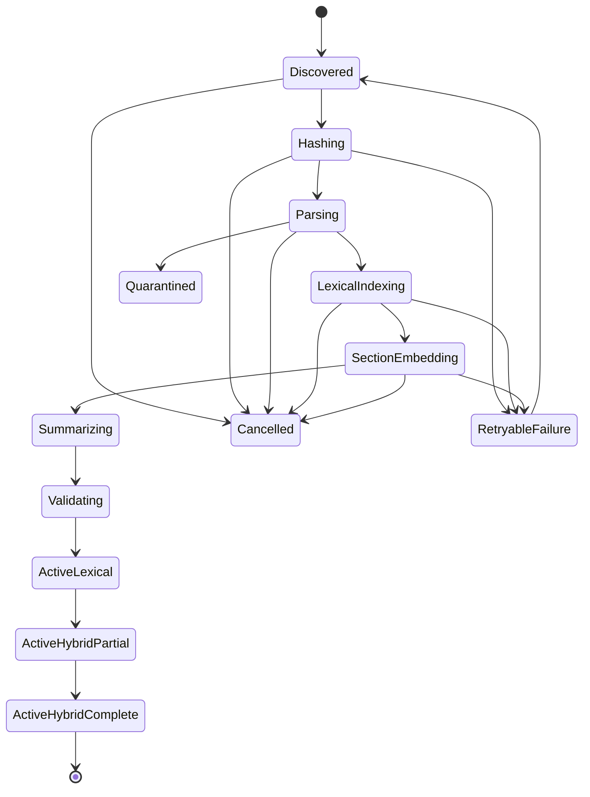

# Hybrid Retrieval Architecture

> Status: implemented; production corpus activation remains operator-controlled
>
> Scope: Cortex Workspace RAG over very large multilingual Markdown corpora
>
> Primary scale target: at least 1,000,000 documents, including exceptional
> documents up to 2 GB
>
> Decision owner: Cortex architecture
>
> Last updated: 2026-07-31

## Decision Summary

Cortex should replace its flat, vector-only Workspace RAG pipeline with a
versioned hybrid evidence-retrieval pipeline that has three indexed levels:

The implemented retrieval progression is **document → section → passage**.

1. **Document** records route a query using title, source, type, jurisdiction,
   dates, parties, language distribution, table of contents, and a short
   summary.
2. **Section** records represent headings, chapters, clauses, annexes, dated
   entries, tables, and other logical units. This is the preferred semantic
   routing level.
3. **Passage** records are bounded fragments of original text used as evidence
   and citations.

The initial search plane remains PostgreSQL plus pgvector:

- PostgreSQL stores the control plane, versions, structural manifests,
  authorization metadata, lexical `tsvector` fields, job state, publications,
  retrieval traces, and evaluation judgments.
- pgvector stores document, section, and selected passage embeddings.
- content-addressed local object storage retains immutable source versions and
  range-readable originals.
- the existing CUDA embedding service remains the first dense encoder.
- a separate, optional local reranker scores only a small fused candidate set.

OpenSearch is **not** an initial dependency. Cortex already operates PostgreSQL
and pgvector, and its strategic architecture explicitly prefers proving that
stack insufficient before adding another search database. A search-backend
interface will keep OpenSearch available as a later lexical/vector adapter if
measured relevance, latency, concurrency, or index-maintenance gates fail.

Generated summaries are routing aids. Final evidence and citations always come
from the immutable original version.

## Why The Current Pipeline Must Change

The current Workspace RAG implementation is a useful small-corpus baseline, but
its contracts do not support the target corpus:

| Current behavior | Consequence at target scale | Required change |
| --- | --- | --- |
| Recursively collects every Markdown path into arrays before processing | A million-file scan has a large discovery delay, retained path set, and no durable checkpoint | Stream discovery into a resumable job ledger |
| Reads every changed file with `readFile(file, "utf8")` | A 2 GB file becomes one very large JavaScript string and may exhaust the Node process | Stream bytes, decode incrementally, and emit bounded structural units |
| Splits at level 1-3 headings, then every 1,800 characters | Loses clause, paragraph, table, line, and byte boundaries | Structure-aware document/section/passage parser |
| Embeds every chunk | Exceptional files dominate embedding time and vector storage | Tiered eager, asynchronous, and lazy embedding policy |
| Stores one mutable document record per context/path | Previous content is replaced and cannot be cited as an immutable version | Stable document identity plus immutable document versions |
| Searches one flat chunk HNSW index using a query vector | Misses exact names, identifiers, legal references, and lexical wording | Lexical, dense, exact-reference, metadata, and hierarchical retrieval |
| Returns top dense hits directly | Similar chunks from one source can monopolize context | Rank fusion, reranking, deduplication, diversity, and neighbour expansion |
| Stores chunk text without byte/line ranges or hierarchy | Citations resolve to a path, not deterministic original evidence | Version, heading path, byte range, and line range on every passage |
| Has no cancellation endpoint or durable per-file job state | A million-file reindex is difficult to pause, resume, or inspect | Cancellable, checkpointed ingestion jobs |

The V2 implementation that replaced these constraints is concentrated in:

- streaming structural parsing:
  [`workspace-rag/src/v2/parser.ts`](../local-agent/matbot/packages/plugins/workspace-rag/src/v2/parser.ts);
- discovery, reconciliation, tiered embeddings, and publication:
  [`workspace-rag/src/v2/manager.ts`](../local-agent/matbot/packages/plugins/workspace-rag/src/v2/manager.ts);
- V2 PostgreSQL/pgvector persistence:
  [`workspace-rag/src/v2/postgres-repository.ts`](../local-agent/matbot/packages/plugins/workspace-rag/src/v2/postgres-repository.ts).

The redesign preserves the `workspace_rag` and `KnowledgeIndex` integration and
the user-facing concept of a workspace RAG context. V2 is now the only retrieval
implementation and evidence schema.

## Architectural Principles

1. **Originals are authoritative.** Indexes, summaries, translations, entities,
   and embeddings are reproducible derivatives.
2. **Bound memory by policy, not source size.** No ingestion phase may require
   the full file in memory.
3. **Preserve structure before choosing chunk sizes.** Article, clause, heading,
   paragraph, list, table, sentence, and only then token boundaries.
4. **Retrieve broadly, answer narrowly.** Routing summaries improve recall;
   original passages support conclusions.
5. **Authorization is a query constraint.** It is never delegated to the
   language model or applied only after retrieval.
6. **Versions are immutable and atomically published.** A partial index does not
   silently replace the active version.
7. **Ranking is inspectable.** Every candidate keeps retriever, rank, score,
   fusion, reranker, selection, and exclusion reasons.
8. **Model changes are index migrations.** Model, dimensions, normalization,
   prefixes, tokenizer, and preprocessing form one embedding signature.
9. **Expensive features earn their place through evaluation.** Corpus-specific
   judgments decide models, weights, thresholds, and late-interaction features.
10. **One exceptional file cannot own the vector budget.** Large-document
    policies cap eager embeddings and promote cold content on demand.

## Target Architecture



### Component Boundaries

| Component | Responsibility | Cortex integration |
| --- | --- | --- |
| `RagDiscoveryService` | Stream paths, stat sources, detect changes, checkpoint progress | Replaces array-returning recursive discovery |
| `RagObjectStore` | Put/open immutable content by hash; read byte ranges | Local Docker volume first; interface permits external object stores later |
| `MarkdownStructureScanner` | Incremental UTF-8 decoding and structural events | Replaces whole-file `readFile` and `chunkMarkdown` |
| `RagCatalog` | Collections, documents, versions, sections, passages, routing-summary versions, ACLs, jobs, publications | PostgreSQL schema `workspace_rag_v2` |
| `LexicalRetriever` | Full-text, phrase, identifier, prefix, proximity, and narrowed regex search | PostgreSQL GIN/trigram baseline |
| `DenseRetriever` | Collection, document, section, and selected passage ANN/exact search | pgvector, partitioned by embedding signature and level |
| `QueryPlanner` | Deterministic extraction plus optional structured model analysis | New internal service used by tool and per-turn hook |
| `RankFusion` | Inspectable application-side Reciprocal Rank Fusion | New pure TypeScript module |
| `RerankerClient` | Cross-encoder scoring for a bounded candidate set | Optional local service; retrieval still works when degraded |
| `EvidenceAssembler` | Diversity, adjacent ranges, token budget, and citation objects | Replaces concatenated path/chunk context |
| existing `SourceRegistry` | Stable source/version identity, health, freshness, citation policy | Canonical source identity; V2 catalog references its ids |
| existing `ConnectorRegistry` | Grants and audit policy | Supplies effective principal and connector permissions |
| existing `ContextGraph` | Source-backed entity/relationship expansion | Optional post-retrieval expansion, never an ACL bypass |
| existing evaluation service | Retriever spans, judgments, replay, metrics | Stores V2 stage timings and ranked hits |

## Retrieval Hierarchy And Records

### Collection Level

A collection groups files that form one logical work, such as chapters of a
book or volumes of a manual. Markdown declares the stable grouping with
`collection_id` and optional `collection_title`; `book_id`/`book_title` and
`series_id`/`series` are accepted aliases. Collection versions are derived from
the ordered active document-version set, so membership or source changes create
a new routing version without changing the underlying citations.

Collection lexical and dense retrieval runs before document routing. It narrows
large split works while retaining the global passage safety lane. A collection
record and its summaries are routing derivatives only; evidence must still be
rehydrated and hash-verified from a passage in an immutable document version.

### Document Level

Create one searchable document record per immutable document version:

```ts
interface RagDocumentRecord {
  documentId: string;              // stable across versions
  documentVersionId: string;       // immutable
  sourceId: string;                // SourceRegistry source
  sourceVersionId: string;         // SourceRegistry version
  workspaceId: string;
  contextId: string;
  title: string;
  sourceUri: string;
  documentType?: string;
  jurisdiction?: string;
  governingLaw?: string;
  parties: string[];
  publicationDate?: string;
  validFrom?: string;
  validTo?: string;
  languageDistribution: Record<string, number>;
  byteLength: number;
  lineCount: number;
  contentSha256: string;
  tableOfContents: HeadingRef[];
  routingSummary?: string;
  publicationState:
    | "staging"
    | "active_lexical"
    | "active_hybrid_partial"
    | "active_hybrid_complete"
    | "retired"
    | "quarantined";
}
```

Document summaries answer “which sources might contain the answer?” They are
never selected as final evidence.

### Versioned Semantic Routing Summaries

When `CORTEX_RAG_V2_SUMMARY_PROVIDER` selects a configured provider, ingestion
queues bounded asynchronous summaries for every section, document, and
collection. Each derivative is keyed by level, unit version, source-content
hash, and summarizer signature (provider, model, prompt revision). Completed
content/signature matches are reused across duplicate or repeated ingestion;
source or model changes create a new immutable summary record.

The queue has configurable concurrency and capacity and applies backpressure to
ingestion rather than growing without bound. The initial extractive routing text
keeps the index searchable before model summaries finish. Successful semantic
summaries replace only the unit's routing text/vector. They do not have passage
IDs or source ranges, cannot enter evidence assembly, and are never citations.

### Section Level

A section is a meaningful structural range:

- Markdown heading and its descendants;
- legal article, chapter, numbered clause, or annex;
- dated log entry;
- table with its title and headers;
- another typed content block.

Front matter is parsed into routing/filter metadata and is deliberately not
emitted as a citeable passage.

Each section stores its heading path, original range, language distribution,
entities, structural type, content hash, token estimate, and optional routing
summary. Section embeddings are the preferred semantic index because they give
the planner substantially better scope than millions of unrelated leaf
passages.

Section identity is deterministic within an immutable version:

```text
section_id = UUIDv5(
  document_version_id,
  normalized_heading_path + structural_type + same_path_ordinal
)
```

Repeated headings require the ordinal. Line numbers alone are not identity
because an insertion near the start shifts every later line.

### Passage Level

A passage is citeable original evidence. Initial splitting priorities are:

1. article, clause, heading, or typed structural unit;
2. paragraph;
3. list while retaining its introduction;
4. bounded table row range with repeated headers;
5. sentence;
6. token boundary only as a last resort.

Initial, evaluation-controlled values:

- normal target: 600-900 tokens;
- small clauses may remain intact below the target;
- hard maximum: approximately 1,200 tokens;
- overlap: normally none across structural boundaries, otherwise 50-120 tokens;
- every passage: heading path, previous/next ids, start/end byte, start/end line,
  language, content hash, and token count.

The exact values are experiment parameters, not permanent constants.

```ts
interface RagPassageManifest {
  passageId: string;
  documentId: string;
  documentVersionId: string;
  sectionId: string;
  ordinal: number;
  headingPath: string[];
  startByte: number;
  endByte: number;                 // exclusive
  startLine: number;
  endLine: number;                 // inclusive
  previousPassageId?: string;
  nextPassageId?: string;
  language: string | "und";
  contentSha256: string;
  tokenCount: number;
  lexicalState: "pending" | "ready" | "failed";
  embeddingState: "not_planned" | "queued" | "ready" | "failed" | "evicted";
}
```

Passage text may be retained in the lexical table for fast retrieval, but the
immutable object and manifest remain the citation authority.

## Streaming Ingestion And Versioning

### Discovery

`collectMarkdownFiles(): Promise<string[]>` becomes an async iterator backed by
a durable discovery job:

```ts
interface DiscoveredSource {
  workspaceId: string;
  contextId: string;
  normalizedPath: string;
  size: number;
  modifiedAt: string;
  discoveryCursor: string;
}
```

The scanner writes batches to `ingestion_job_items` and advances a checkpoint.
It does not retain the whole corpus in Node memory. A restart resumes from the
last committed cursor. A reconciliation pass marks disappeared paths only after
discovery completes successfully; cancellation never makes unseen files look
deleted.

For the first million-document census, file size and modification time avoid
hashing unchanged sources. Filesystem watchers can reduce later work but never
replace periodic reconciliation because events can be dropped.

### Immutable Version Creation

For a changed source:

1. open the source with sequential-read behavior;
2. stream SHA-256 calculation while copying to a staging object;
3. validate UTF-8 incrementally, recording replacement/error policy;
4. atomically publish the content-addressed object;
5. reuse an existing version if the same content hash is already known;
6. otherwise create a staging `document_version`.

The object key is derived from the content hash, not the mutable path:

```text
objects/sha256/ab/cd/abcdef.../source.md
```

Managed object retention is configurable:

- `managed`: Cortex retains the immutable bytes and guarantees historical
  citations;
- `external_immutable`: a connector guarantees immutable, range-readable
  versions;
- `manifest_only`: Cortex records the version but cannot guarantee historical
  byte retrieval if the original changes. This mode should carry a citation
  warning and is not suitable for compliance-sensitive sources.

### Streaming Parser

The parser uses `createReadStream`, incremental UTF-8 decoding, and a
line-oriented state machine. Its memory budget is independent of file size.
It recognizes at minimum:

- YAML front matter;
- ATX and setext headings;
- numbered articles and legal clauses;
- paragraphs and lists;
- tables;
- block quotes;
- fenced code blocks;
- links and footnotes;
- page/source markers from conversion pipelines.

```ts
interface MarkdownUnit {
  type:
    | "front_matter"
    | "heading"
    | "clause"
    | "paragraph"
    | "list"
    | "table"
    | "quote"
    | "code";
  headingPath: string[];
  startByte: number;
  endByte: number;
  startLine: number;
  endLine: number;
  text: string;                    // bounded unit buffer
}
```

The target parser budget is 16-64 MB per active file including decode, table,
and batch buffers. Oversized single paragraphs, code blocks, or table rows are
spooled to temporary bounded objects and split safely; they do not defeat the
memory contract.

Create a sparse line-offset sidecar, for example one byte offset every 1,024
lines, so `fetch_lines` can seek near a requested line without scanning from the
beginning of a 2 GB object.

### Reusing Unchanged Work

Each structural unit is hashed. On a new document version:

1. match exact unit hashes;
2. prefer the same structural path and nearby ordinal;
3. reuse summaries and embeddings when their model/preprocessing signature is
   identical;
4. create new manifests with the new version's byte/line ranges;
5. embed or summarize only changed units.

Embeddings are content-addressed derivatives:

```text
embedding_key =
  SHA256(level + normalized_text_hash + embedding_signature)
```

This permits reuse across versions and exact duplicate documents without
confusing their source identities or citations.

### Job State Machine



Required admin actions:

- `ingestion_start`;
- `ingestion_pause`;
- `ingestion_resume`;
- `ingestion_cancel`;
- `ingestion_retry`;
- `ingestion_status`;
- `reconcile_now`.

Cancellation is cooperative at batch/unit boundaries, leaves the currently
active publication untouched, and never requires stopping Matbot.

## Tiered Policy For Exceptional Files

The corpus census must choose final thresholds. Use these only as safe prototype
defaults:

| Source size | Lexical index | Document vectors | Section vectors | Passage vectors |
| --- | --- | --- | --- | --- |
| Up to 20 MB | All passages | Eager | Eager | Eager |
| 20-250 MB | All passages | Eager | Eager | Async for configured priority/hot sections |
| Above 250 MB | All bounded passages | Eager | Eager | Lazy; no indiscriminate full-file embedding |

Additional safeguards:

- cap eager passage vectors per document and per ingestion job;
- maintain embedding-byte and GPU-time budgets per workspace;
- prioritize signed/current/authoritative sources over archives;
- prioritize explicitly referenced documents and sections;
- record `active_hybrid_partial` so the planner knows dense passage coverage is
  incomplete;
- perform immediate lexical leaf retrieval when a selected section has no
  passage vectors;
- queue a content-addressed lazy embedding job after the answer path;
- optionally retain hot vectors by access count and recency; eviction changes
  only a derivative cache, never the lexical index or citation manifest.

This policy prevents one 2 GB file from producing hundreds of thousands of
eager vectors while keeping all of its original text lexically searchable.

## PostgreSQL Data Model

Use the dedicated schema `workspace_rag_v2`; obsolete flat-index tables are not
read or written by the runtime.

Principal tables:

```text
documents
document_versions
document_version_acl
source_objects

sections
passages
section_summaries
document_summaries
unit_embeddings_<dimensions>

ingestion_jobs
ingestion_job_items
derivative_jobs
index_publications

retrieval_runs
retrieval_query_variants
retrieval_hits
retrieval_evidence

evaluation_queries
relevance_judgments
evaluation_runs
evaluation_metrics
```

### Identity And Publication

- `documents.source_id` references the stable `SourceRegistry` source.
- `document_versions.source_version_id` references its immutable version.
- active publication is selected by `(workspace_id, context_id,
  publication_generation)`.
- new records are written under a staging generation.
- integrity checks verify manifest coverage, ranges, hashes, lexical readiness,
  required embeddings, and authorization fields.
- one transaction switches the active generation.
- previous generations remain readable for in-flight retrieval and rollback,
  then retire asynchronously.

### Lexical Fields

Every document, section, and passage has:

- a `simple` Unicode/exact `tsvector`;
- weighted title/heading/reference lexemes;
- language-specific `tsvector` fields where PostgreSQL has a validated
  configuration;
- normalized exact identifiers in keyword columns;
- optional `pg_trgm` fields for spelling variation and controlled substring
  lookup.

Use GIN indexes for `tsvector` fields. PostgreSQL documents GIN as the preferred
text-search index type. The baseline Polish path should retain diacritics and
use the `simple` configuration plus normalized exact/reference fields until a
corpus evaluation validates a Polish stemming dictionary. Do not silently apply
an English stemmer to Polish text.

Lexical query variants may use:

- `websearch_to_tsquery` for user phrasing;
- `phraseto_tsquery` for quoted text;
- exact keyword fields for contract, case, article, invoice, tax, and company
  identifiers;
- language-specific queries only for fields whose language is known;
- bounded trigram matching for names or OCR variation.

### Vector Fields And Partitions

Preserve the current embedding-signature invariant. A signature includes:

- backend and model revision;
- dimensions and precision;
- tokenizer/max input;
- normalization;
- query/document prefixes or task instructions;
- preprocessing version.

Use separate physical vector indexes by compatible dimensions, level, and
signature. Evaluate `halfvec` indexes with full-precision reranking if storage
or HNSW working set is material. pgvector documents half-precision and binary
quantization as scale options; neither should be enabled without recall
measurement.

Partitioning must follow measured query isolation:

- first isolate workspaces/contexts where this permits pruning and lifecycle
  operations;
- subpartition high-cardinality partitions by document id hash if required;
- keep document, section, and passage levels in separate indexes;
- avoid one partial HNSW index per document or ACL group.

With pgvector approximate indexes, filters are applied after candidate scan.
Enable and test iterative HNSW scans on a pinned pgvector version that supports
them. For a small routed section set, exact vector ordering over the filtered
subset can be faster and more reliable than forcing a global ANN scan.

### Row-Level Security

All V2 tables carry `workspace_id`; evidence-bearing rows also carry resolved
ACL tokens or a joinable version ACL.

For each request transaction:

```sql
SET LOCAL app.workspace_id = '...';
SET LOCAL app.principal_id = '...';
SET LOCAL app.group_ids = '...';
```

PostgreSQL row-level security provides defence in depth. The application account
must not own protected tables and must not have `BYPASSRLS`. The retrieval API
still injects explicit authorization filters because it is the only component
allowed to query evidence indexes.

## Query Planning

The query planner produces an inspectable request:

```ts
interface RetrievalPlan {
  originalQuery: string;
  latestQuestion: string;
  standaloneQuery: string;
  rewriteMethod: "identity" | "deterministic" | "model";
  conversationTurnsUsed: number;
  conversationContextHash?: string;
  queryLanguage: string | "und";
  answerLanguage: string;
  intent:
    | "exact_reference"
    | "fact_lookup"
    | "comparison"
    | "diagnostic"
    | "as_of"
    | "broad_synthesis";
  exactReferences: string[];
  quotedPhrases: string[];
  entities: string[];
  documentTypes: string[];
  jurisdictions: string[];
  asOfDate?: string;
  corpusLanguages: string[];
  lexicalVariants: Array<{ language: string; query: string; reason: string }>;
  iterativeQueries: Array<{ query: string; reason: string }>;
  embeddingInstruction: string;
  authorization: {
    workspaceId: string;
    contextId: string;
    principalId: string;
    groupIds: string[];
  };
}
```

Before planning, Cortex compacts recent human/assistant turns and rewrites a
context-dependent latest question into a standalone retrieval query. The active
turn provider performs the rewrite when available; a bounded deterministic
rewrite preserves the conversation context when the provider fails. Retrieved
context, tool output, and generated routing summaries are excluded from the
conversation state. The original question, rewrite method, turn count, and a
hash of the compact state remain in the trace.

Deterministic code extracts quoted phrases, paths, document identifiers, clause
numbers, statutory references, case references, dates, amounts, currencies,
emails, and company/tax identifiers before an optional language model enriches
the plan. If model analysis fails, the original lexical and dense query still
runs.

The original question is always preserved; retrieval embeds the standalone
query. Controlled lexical translations may improve cross-language exact matching, but a
translation never replaces original source evidence.

## Query Execution

### Stage 1: Collection, Document, And Section Routing

Run in parallel, with authorization and version filters applied inside every
query:

- lexical document retrieval;
- dense document retrieval;
- lexical collection retrieval;
- dense collection retrieval;
- lexical section retrieval;
- dense section retrieval;
- exact-reference retrieval;
- metadata/date/entity filters.

Prototype candidate budgets:

- up to 50 document candidates per retriever;
- up to 100 section candidates per retriever;
- RRF fusion into approximately 10 routed collections, 30 routed documents,
  and 50 routed sections.

Routing is a recall optimization, not a hard gate. Always retain a small global
leaf safety lane so a weak summary cannot make original evidence unreachable.

### Stage 2: Passage Candidate Retrieval

Run these lanes concurrently:

1. scoped lexical passages within routed documents/sections: top 150;
2. scoped exact dense search when the filtered set is small: top 100;
3. global ANN passage safety lane: top 100;
4. exact-reference/phrase lane: top 50;
5. optional translated lexical lanes for major corpus languages: top 50 each.

Candidate counts are caps and must be tuned. A passage is keyed by immutable
`passage_id`, so the same hit from multiple lanes merges without losing its
individual ranks.

### Stage 3: Reciprocal Rank Fusion

Use application-side RRF initially:

```text
rrf_score(candidate) = sum( retriever_weight / (k + rank) )
```

Start with `k = 60` and equal weights except for deterministic exact-reference
matches, which receive a measured boost. RRF uses ranks rather than incomparable
BM25, cosine, trigram, and metadata scores. Persist each contribution so an
operator can explain why a passage appeared.

### Stage 4: Reranking

Rerank only the best 40-100 fused passages with a local multilingual
cross-encoder. Retain approximately 10-25 before context assembly.

Deployment rules:

- reranking has a strict timeout;
- on timeout or service degradation, continue with fused results;
- record model revision, input hashes, duration, and scores;
- do not send generated summaries as if they were original evidence;
- benchmark the reranker on Cortex's Polish, English, German, legal, business,
  and long-document judgments.

The initial candidate is a Text Embeddings Inference-compatible multilingual
reranker such as `Alibaba-NLP/gte-multilingual-reranker-base`; it is a benchmark
candidate, not an architecture mandate.

### Stage 5: Diversity And Expansion

Apply deterministic selection constraints:

- maximum four passages per section;
- maximum eight passages per document;
- suppress exact and near duplicates;
- prefer primary/current/authoritative versions;
- include materially conflicting authoritative sources;
- limit translated query variants from dominating;
- expand previous/next passages only when the selected text crosses a structural
  boundary or is incomplete;
- retrieve the parent section title/metadata without treating its summary as
  evidence;
- preserve a configurable source-diversity floor for broad synthesis.

### Stage 6: Iterative Retrieval And Answerability

After the first candidate pass, comparison and diagnostic intents, sparse
results, or materially conflicting polarity trigger one bounded follow-up pass.
The planner decomposes comparison subjects, searches diagnostic causes and
remediation independently, and adds an authoritative/current-version query for
conflicts. At most four labeled follow-up queries run through lexical and dense
passage lanes and are fused with the original candidates.

After authoritative ranges are fetched and hash-verified, an answerability gate
requires enough distinct evidence for the intent. Comparison and diagnostic
questions require at least two verified passages; comparisons must cover two
sections or documents; exact-reference queries require an exact-reference lane.
Failure returns an explicit `insufficient` result with no evidence exposed to
answer generation. Materially conflicting but adequate sources return
`conflicting` with a warning rather than silently choosing one.

### Stage 7: Evidence Construction

Fetch authoritative ranges and verify their hashes before constructing context:

```json
{
  "evidence_id": "D4-P17",
  "source_id": "src-...",
  "source_version_id": "srcv-...",
  "document_id": "contract-381",
  "document_version_id": "sha256:...",
  "title": "Framework Services Agreement",
  "source_uri": "C:/corpus/contracts/framework-services.md",
  "jurisdiction": "England and Wales",
  "effective_date": "2025-01-01",
  "heading_path": [
    "Termination",
    "Termination for convenience"
  ],
  "byte_range": {
    "from": 90641,
    "to": 92119
  },
  "line_range": {
    "from": 1842,
    "to": 1871
  },
  "language": "en",
  "text": "...",
  "content_sha256": "...",
  "retrieval_reasons": [
    "exact phrase rank 2",
    "dense section rank 4",
    "reranker rank 1"
  ],
  "source_health": "healthy"
}
```

Before the model sees it:

- authorization must still pass;
- the range hash must match the manifest;
- the source version must match the retrieval run;
- stale/degraded source warnings from `SourceRegistry` must be attached;
- evidence ids must be stable within the answer.

The answer renderer resolves citations from evidence ids. The model does not
invent path, version, or line metadata.

## Multilingual Strategy

Detect language at section and passage level. A single business document may
mix Polish, English, German, French, Latin phrases, and identifiers.

Store:

- primary language and confidence;
- distribution when mixed;
- script;
- original text;
- optional derived translation with model/version metadata;
- language-specific lexical vector where supported;
- `simple` lexical vector and exact normalized fields for all passages;
- one multilingual dense embedding.

The current `intfloat/multilingual-e5-base` service remains the migration
baseline because Cortex already validates its 768-dimensional signature and
asymmetric `query:`/`passage:` inputs. Its model card states that long text is
truncated at 512 tokens, reinforcing the need to embed bounded summaries or
passages rather than whole large sections.

Benchmark, do not assume, alternatives:

- `BAAI/bge-m3`: multilingual dense, sparse, and multi-vector modes with an
  8,192-token model limit;
- `Qwen/Qwen3-Embedding-0.6B`: multilingual, instruction-aware embeddings with
  configurable dimensions and a longer model context.

A model wins only if it improves the representative Cortex judgment set within
GPU memory, ingestion throughput, latency, and index-size budgets. Model
replacement creates a side-by-side derivative generation; it never invalidates
the active index in place.

## Exact And Regular-Expression Retrieval

Keep regex as a separate, narrowed evidence operation:

```ts
grepDocuments(authorizedDocumentVersionIds, pattern, options)
fetchSourceRange(documentVersionId, startByte, endByte)
fetchLines(documentVersionId, startLine, endLine)
```

Constraints:

- require an already-authorized list of document versions;
- never accept arbitrary host paths;
- use a non-backtracking engine where supported;
- enforce expression length, timeout, scanned-byte, match-count, and result-byte
  limits;
- search lexical phrase/proximity/wildcard indexes before opening source
  objects;
- record pattern, target versions, limits, duration, and match counts.

Typical flow:

1. hybrid retrieval identifies six candidate contracts;
2. narrowed regex searches those immutable versions for a clause pattern;
3. range fetch returns matches with surrounding structural units;
4. the model compares the exact original provisions.

## Context Graph Integration

The context graph complements rather than replaces hybrid retrieval:

- deterministic entity extraction runs asynchronously after a source version is
  published;
- the existing bulk-scan limit remains until graph throughput is independently
  scaled;
- query entities can seed graph retrieval;
- fused source ids can seed bounded neighbour expansion;
- graph facts must resolve to authorized source versions and evidence spans;
- graph-only relationships without citeable evidence are not final answer
  evidence.

For a million-document ingest, do not enqueue expensive graph extraction for
every unchanged file. Reuse content-hash extraction results and prioritize
changed/current/high-value sources.

## Observability And Evaluation

Every retrieval request creates one `retrieval_run` linked to the existing
evaluation/observability trace.

Persist:

- plan and query variants;
- active publication generation;
- embedding and reranker signatures;
- authorization filter hash, never raw sensitive group membership in ordinary
  logs;
- retriever name, candidate id, raw score, and rank;
- RRF contribution and fused rank;
- reranker score/rank;
- selection or exclusion reason;
- range-fetch verification;
- evidence ids delivered to the model;
- citation ids emitted by the answer;
- duration and candidate count for every stage.

The evaluation set must contain graded judgments for at least:

- exact contractual wording;
- broad conceptual questions;
- cross-language questions;
- Polish morphology and diacritics;
- legal/case/clause references;
- historical “as of” questions;
- comparisons and conflicting sources;
- tables and annexes;
- enormous-document evidence;
- duplicate and near-duplicate sources;
- correct “not present” answers;
- stale/missing source behavior;
- unauthorized source and cross-workspace isolation.

Compare:

1. current flat dense baseline;
2. lexical only;
3. dense only;
4. hybrid RRF;
5. hybrid plus translated lexical variants;
6. hybrid plus reranking;
7. hierarchical routing;
8. hierarchical routing plus lazy passage promotion.

Metrics:

- Recall@K;
- Precision@K;
- nDCG@K;
- mean reciprocal rank;
- routing recall: whether a relevant section survives Stage 1;
- citation range correctness;
- citation version correctness;
- evidence faithfulness;
- unsupported-conclusion rate;
- authorization leakage rate;
- ingestion documents/bytes/passages per second;
- vector bytes and index bytes per source byte;
- P50/P95/P99 stage latency and peak memory.

### Initial Release Gates

These are provisional engineering gates and should become workload-specific
service objectives after the corpus census:

| Gate | Requirement |
| --- | --- |
| Authorization | Zero unauthorized hits in automated isolation tests |
| Versioning | Every selected passage resolves to the exact immutable source version |
| Citation | 100% mechanically valid version/range citations in the judgment set |
| Memory | Parser stays within its configured 16-64 MB per-file budget on a 2 GB fixture |
| Resumability | Cancel/restart resumes without publishing partial data or deleting unseen sources |
| Relevance | Hybrid plus hierarchy improves nDCG and Recall@K over current dense baseline; no critical exact-reference regression |
| Large-file policy | No file above the configured tier threshold receives unbounded eager passage embeddings |
| Latency | Candidate retrieval and reranking meet locally agreed P95 under target concurrency |
| Degradation | Lexical retrieval and citations remain available when embedding or reranking services are down |

## Search Backend Decision And Escalation

### Default: PostgreSQL + pgvector

Advantages for Cortex:

- already deployed in the local Docker stack;
- transactional catalog/publication semantics;
- one authorization and versioning control plane;
- GIN full-text search plus exact structured filters;
- pgvector HNSW, iterative scans, half precision, and quantization options;
- lower operational cost during migration.

Known limitations to measure:

- PostgreSQL text ranking is not a drop-in replacement for every BM25/analyzer
  configuration;
- language analysis, especially Polish stemming, needs explicit validation;
- ANN plus high-selectivity ACL/routing filters can require iterative or exact
  fallback strategies;
- very high ingest concurrency can contend with other Cortex PostgreSQL
  workloads.

### Optional: OpenSearch Adapter

Add OpenSearch only if representative load/evaluation demonstrates one or more
of these after PostgreSQL tuning:

- lexical nDCG/Recall remains below the acceptance threshold because required
  language analyzers or ranking behavior cannot be supplied safely;
- P95 candidate retrieval misses the target at expected concurrency;
- vector/lexical index maintenance materially disrupts Cortex control-plane
  transactions;
- index size, shard lifecycle, or horizontal read scaling exceeds the planned
  PostgreSQL topology;
- native hybrid experiments provide a measured benefit large enough to justify
  another stateful service.

The adapter must implement the same logical contract:

```ts
interface HybridSearchBackend {
  indexGeneration(batch: SearchRecordBatch, signal: AbortSignal): Promise<void>;
  validateGeneration(generationId: string): Promise<ValidationReport>;
  publishGeneration(generationId: string): Promise<void>;
  lexicalSearch(plan: RetrievalPlan, scope: RetrievalScope): Promise<RankedHit[]>;
  denseSearch(plan: RetrievalPlan, scope: RetrievalScope): Promise<RankedHit[]>;
  exactSearch(plan: RetrievalPlan, scope: RetrievalScope): Promise<RankedHit[]>;
  deleteRetiredGeneration(generationId: string): Promise<void>;
}
```

PostgreSQL remains the catalog, authorization source, job ledger, source
registry, retrieval trace, and evaluation store even if a later OpenSearch
adapter owns derivative search indexes.

## Deployment Topology

Initial local topology:

```text
Matbot / workspace-rag-v2 plugin
  |
  +-- PostgreSQL 16 + pinned pgvector
  |     catalog, jobs, ACLs, lexical GIN, vectors, traces, evaluations
  |
  +-- local content-addressed object volume
  |     immutable source versions and sparse line indexes
  |
  +-- workspace-rag-cuda
  |     multilingual embedding endpoint
  |
  +-- optional reranker service
        bounded cross-encoder endpoint
```

Do not couple the design to PostgreSQL 18 merely because the attached proposal
uses it as an example. Cortex currently deploys PostgreSQL 16. Required
capabilities should be expressed and tested explicitly, with a separate upgrade
decision if a newer server release provides a measured benefit.

Pin Postgres, pgvector, embedding model revision, tokenizer, and reranker image
versions. Mutable container tags make index identity and reproducibility
ambiguous.

## Migration Plan

### Implementation Status

Implementation status as of 2026-08-07: all migration activities below are
implemented and executable. A checked activity means the Cortex code path,
operator action, persistence contract, and automated verification exist. It
does **not** mean a million-file production corpus was reindexed: that remains
an explicit, cancellable operator action after the census and release gates,
as required by this design.

| Phase | Implementation evidence |
| --- | --- |
| 0 | Streaming fixed-memory census, approximate duplicate cardinality, forecasts, deterministic sample, and resume checkpoint in `v2/census.ts` and `WorkspaceRagV2Manager.census`; exercised by `workspace-rag-v2-manager.test.mjs`. |
| 1 | Versioned PostgreSQL migrations, non-owner RLS, durable jobs, immutable retention adapters, streaming manifests, atomic publication, and 2 GiB fixture in `v2/postgres-repository.ts`, `v2/object-store.ts`, and `v2/parser.ts`; exercised by parser and live PostgreSQL integration tests. |
| 2 | Collection/document/section/passage lexical+dense routing, conversation-aware standalone-query rewriting, bounded iterative comparison/diagnostic retrieval, explicit answerability/abstention, all eight persisted evaluation ablations, language fields, exact filters, RRF, diversity, evidence verification/faithfulness metrics, V2-only reads, and traces in `v2/retrieval.ts`, `v2/semantic.ts`, and `index.ts`; exercised by manager, plugin, evaluation, and PostgreSQL tests. |
| 3 | Optional multilingual reranker service, timeout/OOM degradation, explicit V2 search, primary mode, and atomic rollback publication; exercised by reranker runtime and plugin tests. |
| 4 | Authority/current/archive priority passes, complete lexical coverage, capped tiered embeddings, bounded asynchronous versioned semantic summaries, collection rebuilding, independent throttles, stage counters/ETA, duplicate-job suppression, pause/resume/cancel, filesystem watchers, periodic reconciliation, path-based rename identity, safe deletion gates, exact derivative reuse keys, and source-registry reconciliation in `v2/manager.ts` and `index.ts`; exercised by manager, coordinator, and plugin tests. |
| 5 | Lazy promotion and eviction, signature-isolated alternative-model generations, full/half/binary pgvector candidate indexes with full-vector reranking, controlled translation, configurable measured RRF weights, optional ColBERT and OpenSearch adapters, and explicit OpenSearch promotion gates; exercised by manager, live PostgreSQL, and adapter tests. |

### Playwright Generated-Corpus Acceptance

The browser-level acceptance suite in
`tests/webui/hybrid-retrieval.spec.mjs` starts an isolated diagnostic HTTP
surface backed by the real `WorkspaceRagV2Manager` and an in-memory V2
repository. It generates small, medium, and cold-tier Markdown documents with
frontmatter, nested headings, multilingual clauses, tables, blockquotes,
lists, fenced YAML, historical versions, exact duplicates, and deterministic
exact references. No workspace-local repository or live backfill is read or
modified.

- [x] Verify atomic publication, complete lexical coverage, and
  collection-to-document-to-section-to-passage hierarchy behavior.
- [x] Verify streaming census measurements, structural counts, duplicates,
  tier sizing, forecasts, and the PostgreSQL/pgvector partition plan.
- [x] Verify exact, lexical, dense, translated, and hierarchical candidate
  lanes with RRF contribution diagnostics.
- [x] Verify immutable byte/line citations by fetching and hashing the cited
  source ranges in the browser workflow.
- [x] Verify multilingual retrieval, original-language evidence, metadata and
  as-of filtering, table/fence structure, bounded regex, and unsafe-regex
  rejection.
- [x] Verify cold lexical retrieval, lazy passage promotion, tier caps,
  diversified duplicate evidence, and lexical availability after embedding
  eviction.
- [x] Verify persisted metrics for all eight retrieval ablations.
- [x] Verify cancellation safety, signature-isolated side-by-side
  publication, reranker degradation, and cross-workspace isolation.

Run this acceptance layer with
`npm run test:webui:hybrid-retrieval`. The backend behaviors are
viewport-independent, so this generated-corpus suite runs once in desktop
Chromium and records intentional skips for the duplicate mobile project.

### Phase 0: Corpus Census

Build a read-only, resumable census before a full reindex:

- [x] File count and total bytes.
- [x] Size percentiles and largest files.
- [x] Update frequency.
- [x] Headings, clauses, paragraphs, tables, and passage estimates.
- [x] Languages and mixed-language rate.
- [x] Exact and near-duplicate rate using fixed-memory cardinality estimates
  with the error bound reported.
- [x] Current/archive/authority distribution.
- [x] ACL cardinality.
- [x] Projected lexical, vector, and HNSW sizes.

No embeddings are required for the census.

Deliverable: [x] measured tier thresholds, storage forecast, partition plan,
and representative sample manifest.

### Phase 1: V2 Contracts And Streaming Ingestion

- [x] Add the V2 schema and migration runner.
- [x] Implement discovery iterator and durable job ledger.
- [x] Add cancellation/pause/resume.
- [x] Implement immutable object and range-read interfaces.
- [x] Implement streaming parser with byte/line manifests.
- [x] Publish lexical-only versions atomically.
- [x] Expose V2 status without changing automatic context retrieval.

Deliverable: [x] a 2 GB fixture can be indexed lexically within the memory
budget, cancelled, resumed, and cited by range.

### Phase 2: Hybrid Baseline

- [x] Add asynchronous versioned collection/document/section routing summaries
  and E5-compatible signature-aware embeddings.
- [x] Add selected passage embeddings.
- [x] Add PostgreSQL lexical retriever.
- [x] Implement query analysis, exact-reference extraction, RRF, diversity,
  and evidence objects.
- [x] Rewrite conversational follow-ups, run one bounded evidence-driven
  follow-up pass, and abstain explicitly when verified evidence is insufficient.
- [x] Route all `workspace_rag` and automatic-context reads through V2.
- [x] Persist retrieval traces for every V2 query and evaluation variant.

Deliverable: [x] representative-sample evaluation contracts, graded judgments,
variant configuration, persisted metrics, and V2 retrieval traces.

### Phase 3: Reranking And Controlled Rollout

- [x] Deploy the optional reranker.
- [x] Tune candidate counts and RRF weights through persisted judgments and
  bounded configuration.
- [x] Enable V2 for explicit `workspace_rag` `v2_search`.
- [x] Enable V2 automatic per-turn context for selected workspace processes
  through `CORTEX_RAG_V2_MODE=primary`.
- [x] Retain atomic V2 publication rollback while removing flat-index fallback.

Deliverable: [x] executable release-gate metrics and
mobile/desktop-independent backend tests. Production-load measurements remain
an operator-supplied gate input and cannot be fabricated by implementation.

### Phase 4: Million-Document Backfill

- [x] Backfill authoritative/current sources before archives.
- [x] Publish lexical availability before complete dense coverage.
- [x] Rate-limit GPU, storage writes, context-graph enrichment, and source
  metadata work independently.
- [x] Report documents, bytes, sections, passages, lexical/vector coverage,
  failures, throughput, and estimated completion by stage.
- [x] Never queue a duplicate full reindex while one is running.

Deliverable: [x] an explicit, cancellable backfill path that publishes active
lexical coverage and measured hybrid coverage without blocking normal Cortex
use. Running it against the production corpus is intentionally not automatic.

### Phase 5: Evidence-Based Optimizations

Only after measured gaps:

- [x] Lazy embedding promotion/eviction.
- [x] Half-precision or binary-quantized vector candidate indexes with
  full-precision reranking.
- [x] Alternative embedding models through signature/dimension-isolated
  derivative generations.
- [x] Controlled query translation that never replaces original evidence.
- [x] Measured/configurable RRF weights with persisted contributions.
- [x] Measurement-gated late-interaction retrieval through a
  ColBERT-compatible local adapter.
- [x] OpenSearch adapter with atomic aliases and explicit promotion gates.

## Compatibility And Rollback

- keep the `cortex-rag.json` context and path configuration contract;
- select backend/generation through tracked runtime defaults and explicit
  feature flags, not machine-local workspace files;
- keep `workspace_rag.search` path, score, and text fields while adding V2
  document/version/range metadata;
- rollback switches to the prior validated V2 publication, never a partially
  discovered staging generation;
- `CORTEX_RAG_V2_MODE=off` disables Workspace RAG when the V2 service must be
  taken out of rotation; there is no flat-index fallback.

## Risks And Mitigations

| Risk | Mitigation |
| --- | --- |
| Summaries omit the only relevant concept | Global leaf safety lane; summaries never become a hard gate |
| HNSW filtering loses authorized/routed results | Iterative scans, exact scoped search, global safety lane, recall evaluation |
| Generated summary is cited as fact | Evidence assembler accepts original manifests only |
| A source changes during streaming | Stat before/after, content hash, immutable staged object, retry on unstable source |
| Million-file cancellation marks files deleted | Reconcile deletions only after a complete discovery generation |
| Lazy embeddings make results nondeterministic | Lexical path is always complete; record coverage and embedding generation |
| Cross-language query translation changes meaning | Preserve original query; translations are labeled expansions only |
| Duplicate corpus inflates indexes/context | Content-addressed derivatives plus source-distinct citations and deduplication |
| PostgreSQL competes with Mem0/control-plane traffic | Separate schema, resource monitoring, connection pools, and optional dedicated instance |
| New search service creates operational burden | OpenSearch only behind explicit measured promotion gates |
| Object retention doubles storage | Census forecast, content deduplication, configurable retention classes |

## Explicit Non-Goals

- literal implementation of the full RAPTOR clustering algorithm;
- embedding every byte of every 2 GB file;
- replacing Source Registry, Connector Fabric, Context Graph, or the evaluation
  service;
- letting an LLM construct authorization filters;
- treating machine translations or generated summaries as source truth;
- corpus-wide unrestricted regex over arbitrary filesystem paths;
- selecting a new embedding model from public leaderboard results alone;
- introducing OpenSearch before the PostgreSQL baseline is measured.

## Research Basis

- [RAPTOR](https://arxiv.org/abs/2401.18059) supports retrieval across multiple
  abstraction levels; Cortex adopts the hierarchy principle without requiring
  recursive clustering.
- [PostgreSQL full-text search](https://www.postgresql.org/docs/current/textsearch.html)
  provides `tsvector`, query parsing, ranking, and GIN-indexed retrieval.
- [PostgreSQL partitioning](https://www.postgresql.org/docs/current/ddl-partitioning.html)
  provides the baseline lifecycle and pruning mechanism, subject to a
  corpus-specific partition design.
- [PostgreSQL row security](https://www.postgresql.org/docs/current/ddl-rowsecurity.html)
  provides defence-in-depth tenant/workspace policy enforcement.
- [pgvector](https://github.com/pgvector/pgvector) documents HNSW, filtering,
  iterative scans, half-precision indexes, binary quantization, and recall
  monitoring.
- [OpenSearch hybrid search](https://docs.opensearch.org/latest/vector-search/ai-search/hybrid-search/index/)
  documents score normalization and rank-based hybrid processors and informs
  the optional adapter.
- [`intfloat/multilingual-e5-base`](https://huggingface.co/intfloat/multilingual-e5-base)
  documents the current baseline model and its 512-token truncation.
- [`BAAI/bge-m3`](https://huggingface.co/BAAI/bge-m3) and
  [`Qwen/Qwen3-Embedding-0.6B`](https://huggingface.co/Qwen/Qwen3-Embedding-0.6B)
  are evaluation candidates for longer multilingual inputs and alternative
  vector dimensions.
- [Text Embeddings Inference supported models](https://huggingface.co/docs/text-embeddings-inference/en/supported_models)
  documents supported multilingual reranker families.
