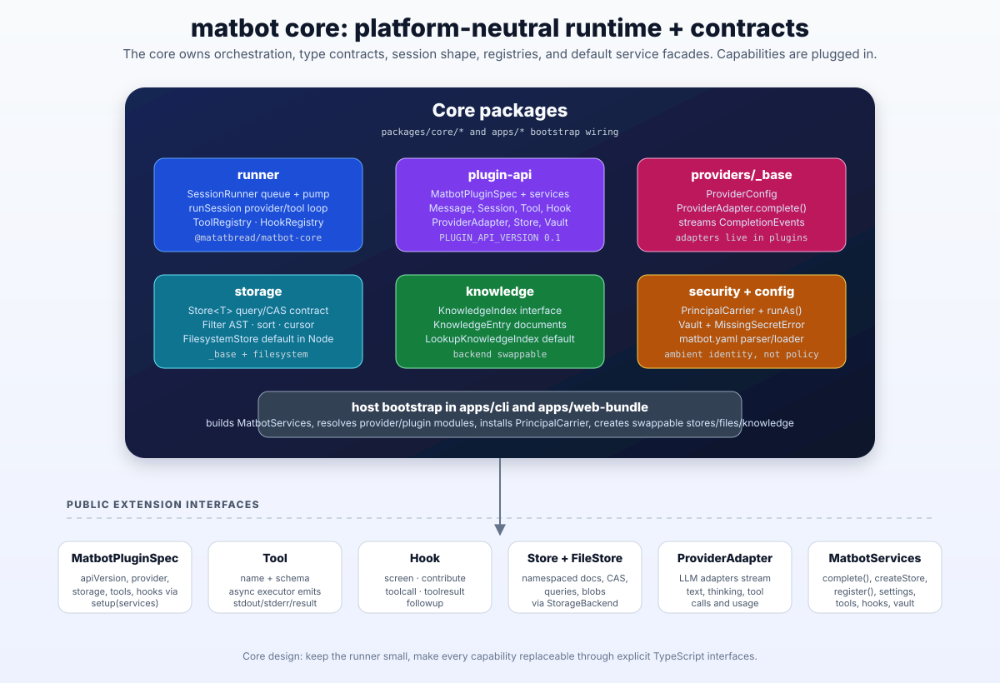
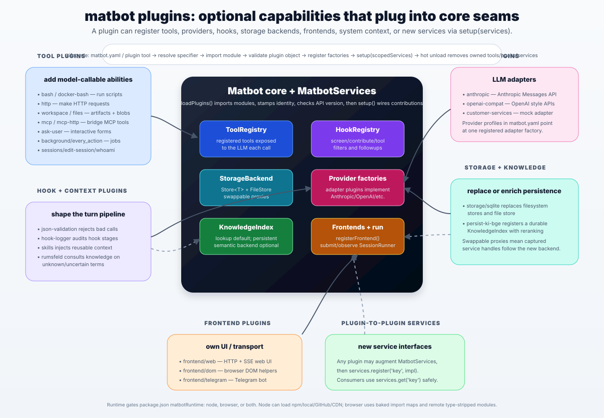
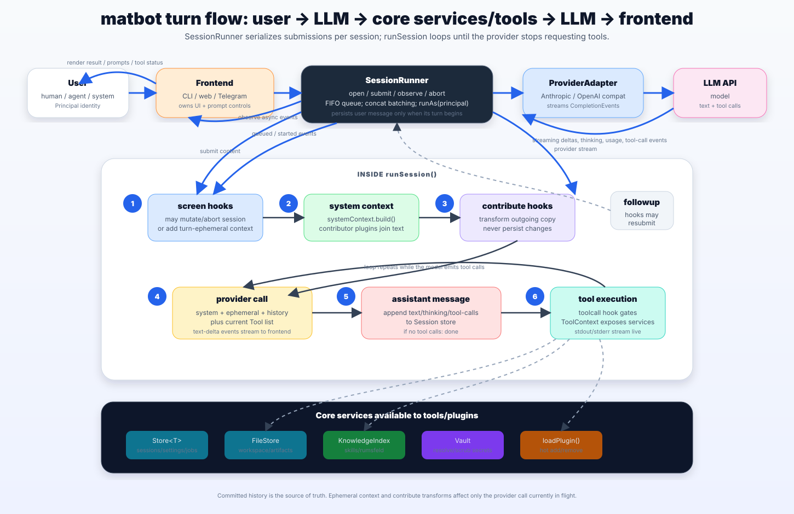

# matbot Architecture

A visual tour of how matbot fits together, in three views: the platform-neutral **core**,
the **plugins** that extend it through well-defined seams, and the **turn flow** that ties them
together at runtime. For the authoritative design principles behind these diagrams, see
[CLAUDE.md](../CLAUDE.md); for the plugin API reference, [DEVELOPING.md](DEVELOPING.md).

## Target architecture and boundaries

The [Cortex architecture](../../../docs/architecture.md#target-architecture-and-boundaries)
is the current responsibility map after the C1–C14 migration. Its diagram and
contract tables cover host composition, runtime enforcement, capability ownership,
frontends, adapters and external services. The SVG views below illustrate the
underlying runtime seams; the [migration guide](../../../docs/plugin-migration.md)
lists the concrete packages and deployment profiles.

| Boundary | Ownership |
| --- | --- |
| Host → runtime | The host selects initial configuration/workspace, installs identity and policy, constructs boot defaults and controls process lifetime. |
| Runtime → capabilities | The runtime provides queues, invocation, hooks, registries, settings/store facades and lifecycle enforcement. Plugins own tools, domain validation, state and resources. |
| Frontend → capability | Frontends submit conversations or invoke tools through the shared gate. Domain plugins contribute UI/routes and own expert-session and attachment operations. |
| Capability → adapter | Consumers depend on portable contracts. The selected implementation owns file, persistence, vault, provider or retrieval resources and declares its supported runtime. |
| Contributor → collection | UI, HTTP, configuration, retrieval and health contributions carry identity, owner and lifetime. Multiple sources use collections; singleton services have one active owner. |
| Runtime → supervisor | Restart, service installation and external process control belong to the host/scripts. Capability health probes report availability. |

Keep product implementations out of `apps/` and new domain behavior out of the
portable runtime. The host can call bootstrap helpers supplied by plugin packages
before normal plugin loading. Optional `runtime-admin`, `model-consultation` and
`frontend-cli-node` now own administration tools and interactive conversation;
existing core factory paths remain compatibility exports.

The standard Cortex profile selects in-process file services and federated
retrieval; compatibility explicitly selects remote file adapters; minimal loads
the configured capability set. Expert/RAG backend families use internal typed
factories where state and publication invariants require a cohesive owner.

---

## 1. Core — the platform-neutral runtime and contracts

The core is infrastructure, not product. It owns orchestration (the `SessionRunner` queue and the
`runSession` provider/tool loop), the type contracts every plugin builds against (`MatbotPluginSpec`,
`Message`, `Session`, `Tool`, `Hook`, `ProviderAdapter`, `Store`, `Vault`), and the default service
facades. Concrete LLM, storage, vault and retrieval adapters are selected through plugins, with
boot defaults available before activation. The host bootstrap (`apps/cli`, `apps/web-bundle`)
owns initial argv/env/config selection: it builds `MatbotServices`, resolves provider and plugin
modules, installs the `PrincipalCarrier` and invocation policy, and creates swappable service
facades. Current Node adapters also read their environment configuration at construction;
portable modules use injected contracts, settings and vault access. The public extension
interfaces include `Tool`, `Hook`, `Store`/`FileStore`, `ProviderAdapter`, `MatbotServices` and the
owner-scoped `ContributionRegistry`.

---

## 2. Plugins — optional capabilities that plug into core seams

A plugin's `setup(services)` can register tools, providers, hooks, storage backends, frontends, system
context, plugin-to-plugin services, and typed UI/HTTP/configuration/retrieval/health contributions.
`loadPlugins()` imports the modules, stamps each with an identity, checks the API version and declared
runtime compatibility, then runs `setup()` to wire the contributions into the core
registries. The families shown — **tool** plugins (bash, http, workspace, mcp, …), **hook/context**
plugins (json-validation, skills, rumsfeld, …), **provider** adapters (anthropic, openai-compat),
**storage/knowledge** backends (sqlite, persist-ki-bge), and **frontend** plugins (web, dom, telegram)
— all attach through the same seams. Core storage/knowledge/vault forwarding proxies follow their
active backend. Arbitrary optional service objects require fresh lookup or `mounted.consume()`;
capturing one during setup does not make it automatically follow replacements.

Failed setup/unload removes owned contributions, aborts tool/contribution lifetimes and runs
teardown. Owners must close their queues, watchers and requests. Feature UI disappears with its
owner, including navigation, handlers and pending tool requests. Plugins run in the trusted host
process; registration supplies lifecycle ownership, not a security sandbox or authorization to
bypass domain resource checks.

---

## 3. Turn flow — user → LLM → core services/tools → LLM → frontend

The `SessionRunner` serialises submissions per session: a FIFO queue, concat batching, and a `pump`
that runs each turn under `runAs(principal)`. Inside `runSession()` a turn proceeds through ordered
stages — `screen` hooks may mutate or abort the session and add turn-ephemeral context; system context
is built and contributor plugins join in; `contribute` hooks transform the outgoing copy without
persisting; the provider is called with system + ephemeral + history plus the current tool list; the
assistant message (text, thinking, tool calls) is appended to the session store; and if the model
emitted tool calls, they enter `executeToolInvocation` for input validation, permissions, call/result
hooks, cancellation and output limits (with stdout/stderr streaming live)
and the loop repeats. Throughout, a tool reaches the services on its `ToolContext` — `Vault`,
`FileStore`, and `loadPlugin()`/`unloadPlugin()`; the broader `MatbotServices` surface (`Store`s via
`createStore`, `KnowledgeIndex`, `complete`, the registry) is what a plugin captures in its `setup()`.

Direct frontend tool requests use the same invocation implementation without asking a model to
select the operation. Noninteractive requests return `approval_required` when consent is needed.
`ExpertSessions` owns the expert composer/session operation and delegates `expert_panel` execution
through that gate; `AttachmentResolver` supplies bounded ephemeral input from workspace artifacts.
The provider picker reads provider-name metadata independently of optional administration tools.

