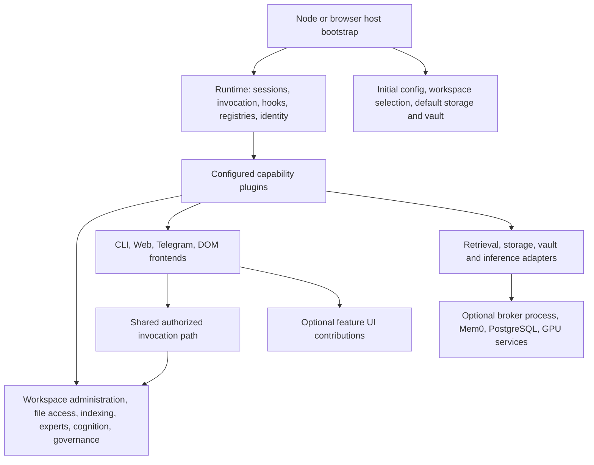

# Missing Plugins - Cortex Architecture Assessment

Reviewed against the repository source on **2026-09-05**. Sections 1–8 preserve the pre-migration assessment and proposal; descriptions of what exists there refer to that review snapshot. **Section 9 records the subsequent C1–C14 implementation.** Priorities describe migration order, not measured usage frequency.

The recommendation is to move independently useful product capabilities into plugins while retaining a small runtime and host bootstrap. The largest opportunities are workspace lifecycle management, host file access and indexing, frontend feature panels, and the model-facing administration tools currently installed by the host. Other opportunities are separations within existing plugins, especially retrieval adapters and expert knowledge sources.

Success means a capability can be configured, exercised, tested, and removed through an explicit contract. Increasing the number of package directories alone does not achieve that. A plugin may provide a service, hook, frontend, or backend without exposing an LLM tool, and may use a separate process when isolation or hardware requires it.

## 1. What Cortex actually provides today

### Runtime and plugin contracts

[plugin-api/src/plugin.ts](local-agent/matbot/packages/core/plugin-api/src/plugin.ts) distinguishes:

- `MatbotRuntime`: fixed operations and registries, including `complete`, `singleTurn`, `createStore`, plugin-scoped `settings()`, tools, hooks, system context, plugin loading, and mount notifications.
- `MatbotServices`: replaceable services, including `StorageBackend`, `Vault`, `KnowledgeIndex`, and optional services added by TypeScript module augmentation.
- `MatbotMachine`: the combination passed to a plugin's `setup()`.
- `MatbotPluginSpec`: lifecycle methods, declarative tools, provider/store factories, and optional startup storage-backend construction. Plugin identity comes from the loader.

Plugins already register tools, services, providers, hooks, system context, storage backends, and frontends. [The loader](local-agent/matbot/packages/core/runner/src/loader.ts) checks plugin shape, API compatibility, and declared `matbotRuntime`, and rolls back failed setup. [The registry](local-agent/matbot/packages/core/runner/src/registry.ts) attributes contributions to their owning plugin and removes them on unload.

These are useful extension mechanisms, with limits:

- Loading and unloading are supported; safe hot replacement of every resource is not automatic. Plugins must cancel work, close resources, and handle disappearing dependencies.
- Core swap services have forwarding proxies. Arbitrary plugin service objects captured during setup are not automatically refreshed. Use a fresh lookup, or `mounted.consume()` when maintaining derived state.
- Storage replacement is deferred to a quiescent boundary. Workspace changes currently involve a process restart, which cannot be replaced by unloading one plugin.
- Plugins execute in the host process. Registration does not create a security sandbox or confer authorization for every operation.
- `registerFrontend()` records a frontend; it does not provide a generic HTTP-route or browser-panel extension API. Those interfaces are proposed below.

The existing [architecture](local-agent/matbot/docs/ARCHITECTURE.md) and [design principles](local-agent/matbot/CLAUDE.md) support this direction: the host handles platform bootstrap, the runtime handles orchestration, and plugins provide concrete capabilities. Some current packages still read environment variables directly or duplicate contracts, so the implementation has not fully reached that separation.

### Existing capabilities to retain and extend

Cortex already has plugins for sessions, workspace artifacts, skills, background scheduling, triggers, cognition, session titling, source provenance, connectors, structured data, workflows, evaluation, context graphs, Workspace RAG, expert reviews, providers, storage, and multiple frontends. See the [plugin catalog](docs/plugins-and-tools.md) for their locations. Bundled availability and selection in a particular configuration are separate facts.

Do not create competing replacements for these capabilities. For example, [background](local-agent/matbot/packages/plugins/background/src/index.ts) already persists recurring schedules and `workflow-governance` owns workflow state. Workspace RAG owns reconciliation and orphan garbage collection. Their internal responsibilities can be factored without inventing another scheduler or cleanup subsystem.

A directory under `packages/plugins` is not proof of a loadable plugin: [files/src/index.ts](local-agent/matbot/packages/plugins/files/src/index.ts) exports `FilesystemFileStore`, while [storage/filesystem](local-agent/matbot/packages/plugins/storage/filesystem/src/index.ts) exports an actual plugin and backend factory. Supporting libraries remain legitimate architecture components.

## 2. Corrections to the original candidate list

| Original candidate or claim | Source-grounded finding | Revised assessment |
| --- | --- | --- |
| File-index has no tool integration and indexing is just a tool. | [HybridKnowledgeIndex](local-agent/matbot/plugins/hybrid-knowledge-index/src/index.ts) already searches file-index over HTTP; `contextual_search` consumes `KnowledgeIndex`. [file-index/server.ts](local-agent/file-index/src/server.ts) owns an indexing queue, persisted snapshots, policy loading, and HTTP routes. | Extract a service-owning plugin, then expose management tools and optional HTTP compatibility. A tool wrapper alone leaves the main responsibility outside plugins. |
| File-broker already has a plugin implementation, so its HTTP server is redundant. | [plugins/file-broker](local-agent/matbot/plugins/file-broker/src/index.ts) is an HTTP client. Policy checks, verified file access, backups, and writes live in [local-agent/file-broker](local-agent/file-broker/src/server.ts). | Migrate the implementation before retiring any server. Preserve `file_broker_action` and a selectable remote adapter. |
| WebUI needs to become a plugin or shed its HTTP server. | [frontend/web](local-agent/matbot/packages/plugins/frontend/web/src/plugin.ts) is already a frontend plugin. Its server contains workspace deletion checks, attachment preparation, and expert-session orchestration; its browser app contains domain-specific panels. | Extract feature ownership and add frontend extension contracts first. A frontend owning HTTP/SSE is valid. A separate reusable HTTP host is optional. |
| Expert configuration is hardcoded to one path. | [config.ts](local-agent/matbot/plugins/expert-panel/src/config.ts) supports `EXPERT_PANEL_CONFIG` and a default path. It validates definitions and roots. [index.ts](local-agent/matbot/plugins/expert-panel/src/index.ts) constructs `FileExpertKnowledge` directly during setup. | The missing seam is configuration/knowledge providers and refresh behavior, not a configurable path. |
| Workspace management exists only inside the WebUI server; add `workspace_action`. | `FileWorkspaceManager` lives in [apps/cli/src/index.ts](local-agent/matbot/apps/cli/src/index.ts); the host publishes it as `WorkspaceManager`. The web server adapts it to `/workspaces` routes. [workspace](local-agent/matbot/packages/plugins/workspace/src/index.ts) already owns `workspace_action` for uploaded/generated files. | Extract the existing manager and use a distinct proposed tool, `workspace_admin_action`. Move deletion readiness into the service as well. |
| Configuration has no UI, tools, or versioned storage. | [PluginSettings](local-agent/matbot/packages/core/runner/src/settings.ts) has scoped persistence and CAS versions. [Workspace RAG](local-agent/matbot/packages/plugins/workspace-rag/src/index.ts) exposes `get_config`/`configure`, used by the settings screen; `cognition_config` and provider-management tools also exist. | A unified validated administration/history interface is missing. Existing settings are not an immutable audit history; bootstrap YAML loading must remain available before plugins load. |

## 3. Target architecture and boundaries

The current post-migration responsibility map is maintained in [Architecture and Core Systems](docs/architecture.md#target-architecture-and-boundaries). The section below preserves the original proposal that guided the migration.

Use a plugin when functionality has an independent reason to be enabled, an independently replaceable implementation, a lifecycle/resource owner, or an optional user-facing surface. Keep tightly coupled algorithms and small helpers together when they share configuration, state, and release lifecycle.

The diagram shows proposed responsibility boundaries, not an existing package graph.

| Remain in runtime or host infrastructure | Move into or remain owned by plugins |
| --- | --- |
| Session queue, provider/tool loop, generic cancellation, streaming, schema enforcement, permission enforcement, hook dispatch, identity context. | Domain tools, retrieval policy, expert orchestration, workflows, memory policy, feature-specific validation and presentation. |
| Service registry, plugin identity/loading, settings/store facades, quiescence, default boot services. | Concrete persistence, vault, inference, retrieval, and host-file implementations behind those contracts. |
| Initial argv/env/config reading, config-path selection, module resolution, process launch/restart/shutdown. | Workspace CRUD, ongoing settings administration, provider/plugin management UI and tools, interactive CLI conversation. |
| Shared path/HTTP/encoding helpers and generic contracts. | Runtime ownership of file operations, indexing jobs, feature panels, and health probes. |
| Docker/Windows service installation and external service supervision. | Client adapters, dependency health reporting, and optional application-level lifecycle controls. |

Keep common contracts portable. Follow the repository's `*-types`, `*-node`, and `*-browser` naming direction for new packages and declare runtime compatibility. Do not make browser bundles import Node filesystem/process implementations through a shared barrel. PostgreSQL, Neo4j, Mem0, and Python/GPU services can remain external; their Cortex integration belongs behind plugins.

## 4. Prerequisites for further extraction

### 4.1 Typed contracts and ownership

Introduce small interface packages where there is a real provider/consumer boundary. First candidates are `WorkspaceManager`, a read-only `WorkspaceContext`, `HostFileAccess`, `FileIndex`, expert sources, and frontend extension contracts. Augment `MatbotServices` there and use the typed registry.

The host's untyped `WorkspaceManager` registration, the web plugin's local interface copies, Workspace RAG's `as never` registrations, and the hand-written Matbot types in the three `local-agent/matbot/plugins/` integrations are concrete cleanup targets. Consumers should depend on contract packages rather than another plugin's implementation or reduced copies of its API.

Define required versus optional dependencies explicitly. Missing required dependencies should prevent activation with a useful error; optional services can report unavailable/degraded behavior. Do not silently load a substitute or retry over HTTP after an authorization denial. Resolve optional services per call; subscribe to mount/unmount for cached state. Initially use explicit composition order and package dependencies, not an assumed dependency solver in the existing loader.

Maintain one owner per singleton service. For multiple retrieval or UI contributors, use an owner-managed collection with registration handles and disposal; repeatedly replacing the same service key is not a multi-provider registry.

### 4.2 One authorized invocation path

[frontend/web/server.ts](local-agent/matbot/packages/plugins/frontend/web/src/server.ts) calls `tool.executor.execute()` directly for ordinary tool requests and expert-panel submissions. [runner.ts](local-agent/matbot/packages/core/runner/src/runner.ts) additionally applies permission handling and tool hooks, including result processing. Establishing a request principal in the WebUI does not by itself run that pipeline.

Before exposing more administration functions across frontends, extract a generic **proposed `ToolInvoker` runtime primitive** used by model turns and direct frontend calls. Preserve validated input, principal/session/workspace/provider context, permission decisions, cancellation, hooks, result redaction/limits, tracing, and streaming. Distinguish an interactive human request from an autonomous model call so administration capabilities can have appropriate access rules. A noninteractive caller must receive a structured approval-required result when authorization is missing.

This enforcement mechanism stays in the runtime. Feature plugins supply their rules and operations. Moving a sensitive operation to a service must retain authorization at that service boundary as well, since another plugin can call it without an LLM tool.

### 4.3 Explicit lifecycle and availability

Every extraction needs setup-failure cleanup, unload/reload behavior, dependency-loss behavior, and an owner for active work. Track timers, watchers, subscriptions, connections, child processes, and UI assets through disposables or abort signals. Avoid persistent module-level mutable state for new plugins.

The loader can roll back registrations, but cannot infer how to reverse external writes or transfer a running indexing job. Mark capabilities that require draining or restart accordingly. Fail closed when a required file-access policy or authorization service disappears. Reuse existing session/store isolation and retain protected workspace files as local state.

## 5. Candidate inventory and priority

**P0** establishes contracts and enforcement. **P1** extracts responsibilities with substantial architectural value. **P2** follows once those boundaries exist. **P3** is conditional on a concrete deployment or alternate implementation. Effort is relative: S = focused extraction; M = multiple consumers; L = lifecycle/data/transport migration. All entries remain proposed.

| ID | Capability / proposed plugin boundary | Kind | Priority / effort |
| --- | --- | --- | --- |
| C1 | `workspace-manager-node` and `workspace-admin` | Extract host domain logic; shared service and separate administration tool. | P1 / L |
| C2 | `host-file-access-node`, retaining `file_broker_action` | Extract standalone service implementation; selectable HTTP client. | P1 / L |
| C3 | `file-index-node`, with optional `file-index-http` | Extract indexing/search service; tool and retrieval integration. | P1 / L |
| C4 | Feature UI contributions and smaller WebUI shell | Extract domain UI from an existing frontend plugin. | P1 contract and pilot, P2 rollout / L |
| C5 | Expert-session orchestration in `expert-panel` | Move domain orchestration out of web transport. | P1 after invocation contract / M |
| C6 | `runtime-admin` and `model-consultation` | Move host/core model-facing tools into actual plugins. | P2 / M |
| C7 | `frontend-cli-node` | Extract interactive frontend from the host. | P2 / M |
| C8 | `configuration-admin`, with contributor schemas | Unify ongoing administration of existing configurations. | P2 / L |
| C9 | `retrieval-federation`, `memory-mem0`, backend contributions | Separate hardwired sources and query composition inside existing retrieval plugins. | P2 / L |
| C10 | Expert definition and knowledge providers | Extend existing `expert-panel` through swappable sources. | P2 / M |
| C11 | `attachments` / extension of `workspace` | Extract attachment interpretation from WebUI; reuse file stores. | P2 / M |
| C12 | Workspace RAG storage, embedding, reranking, source adapters | Make selected existing internal seams into plugins. | P2 for contracts, P3 per backend / L |
| C13 | `vault-env-node` and optional alternate vault adapters | Make the host vault implementation reusable as a plugin. | P3 / S-M |
| C14 | `runtime-diagnostics` with feature health contributors | Consolidate optional runtime health reporting. | P3 / M |

### C1. Workspace lifecycle management

**Evidence:** `FileWorkspaceManager`, registry persistence, config cloning, rename/delete/switch, and startup selection are in [apps/cli/src/index.ts](local-agent/matbot/apps/cli/src/index.ts). Deletion lock checks against `WorkspaceRagManager` are in [web server](local-agent/matbot/packages/plugins/frontend/web/src/server.ts), while [Workspace RAG](local-agent/matbot/packages/plugins/workspace-rag/src/index.ts) independently finds and reads the registry.

**Recommendation:** Extract the manager to `workspace-manager-node`. Publish typed `WorkspaceManager` and immutable active-runtime `WorkspaceContext` contracts. Add `workspace-admin` with `workspace_admin_action` (`current`, `list`, `create`, `rename`, `delete_check`, `delete`, `switch`). Keep `workspace_action` exclusively for Files-panel artifacts.

Keep the initial config selector usable as a host bootstrap helper from the same package: choosing which workspace's plugins to load cannot depend on first loading those plugins. The host owns process restart and injects a narrow restart callback. The manager owns requested workspace changes; runtime identity reports the configuration actually loaded, rather than prematurely reporting the requested destination.

Move deletion readiness and serialization into the manager, using a proposed lifecycle-participant contract for RAG and other resource owners. Check and reserve deletion against ongoing work in one coordinated operation, rather than relying on an HTTP preflight that can become stale. Preserve inactive/last-workspace checks, owned-directory validation, staged rename, registry rollback, pending purge reporting, and cleanup auditing. Keep RAG publication/object cleanup in RAG, invoked through its participant contract.

**Migration:** Keep `/workspaces` routes as compatibility adapters. Change RAG and Mem0 workspace scoping to consume the same context instead of independently interpreting paths. The manager has installation-level registry state; feature data remains workspace-scoped. Do not put global registry data in a workspace store that vanishes during a switch.

### C2. Host file access and broker transport

**Evidence:** The [broker server](local-agent/file-broker/src/server.ts) coordinates reloadable policy/config, path authorization, verified handles, capped reads, risky-write approval, backups, and diffs. [The plugin](local-agent/matbot/plugins/file-broker/src/index.ts) only forwards tool calls. [paths](local-agent/paths/src/policy.ts) and [file-writer.ts](local-agent/file-broker/src/file-writer.ts) contain behavior that must survive the move.

**Recommendation:** Create a typed `HostFileAccess` service with health/list/read/write operations and context/cancellation inputs. Move request-independent coordination into `host-file-access-node`, retaining path helpers as required libraries. Let the existing tool resolve either the local service or an explicitly selected HTTP implementation through that interface. Register one implementation for an operation.

Retain allowed-root and real-path checks, symlink/handle protections, read limits, backup semantics, diffs, and approvals. Bind authorization to the principal and operation; an LLM-supplied `approved: true` is not independent evidence of user consent. Preserve the public payload through a compatibility adapter while introducing trustworthy internal approval handling.

**Deployment:** Offer in-process access for a local trusted installation and a broker process profile where filesystem isolation or multiple clients matter. Preserve loopback, token, origin, body-limit, and cancellation checks at remaining HTTP boundaries. Never automatically switch from a denied remote request to local filesystem access.

**Removal gate:** Retire the mandatory server only after the tool, scripts, tests, and external clients have been audited and a compatibility/profile decision made. The existing plugin cannot run without it today.

### C3. File indexing and search

**Evidence:** [server.ts](local-agent/file-index/src/server.ts) owns the queue and snapshot publication; [indexer.ts](local-agent/file-index/src/indexer.ts), [extract.ts](local-agent/file-index/src/extract.ts), and [search.ts](local-agent/file-index/src/search.ts) provide reusable logic. [file-index-client.ts](local-agent/matbot/plugins/hybrid-knowledge-index/src/file-index-client.ts) is the retrieval consumer.

**Recommendation:** `file-index-node` should own a typed `FileIndex` service: index/reconcile, search, status, job cancellation, and lifecycle cleanup. Preserve the queue and publish a new persisted snapshot only after successful work. Add a proposed `file_index` tool for management and direct search; let retrieval call the service without simulating an LLM tool invocation. An optional `file-index-http` adapter can preserve `/health`, `/index`, and `/search` on port 8877.

Retain configured-root restrictions, exclusions, secret detection, byte limits, and cancellation. Define scope explicitly: today's host index follows configured host roots, while Workspace RAG follows workspace contexts. Any intentionally shared host corpus must be declared and filtered before returning content. Do not merely move a globally readable snapshot into each workspace's plugin instance.

**Relationship to Workspace RAG:** File-index covers broad source/text types with keyword search; Workspace RAG V2 provides hierarchical Markdown retrieval with versioned evidence. First preserve both behind source contracts. Later, migrate supported corpora to the generic V2 collection → document → section → passage pipeline only after extraction, search quality, exclusions, and citations have parity. Avoid a new corpus-specific index or revival of Workspace RAG V1. A shared extraction library is preferable to duplicate parsing; give extractors their own plugins only when independently selectable formats justify that.

### C4. Feature-owned WebUI contributions

**Evidence:** [app.js](local-agent/matbot/packages/plugins/frontend/web/static/app.js) implements source, SQL, workflow, evaluation, graph, expert, workspace-settings, skill, memory, and file interactions. [index.html](local-agent/matbot/packages/plugins/frontend/web/static/index.html) supplies fixed markup. The server has a fixed static-route table. Removing a domain plugin therefore does not remove its frontend implementation.

**Recommendation:** Keep `frontend-web` as the chat/navigation/transport shell. Define proposed frontend-owned `WebUiContribution` and `HttpRouteContribution` contracts, supplied through owner-managed registries. A UI contribution describes its stable ID, navigation placement, required capabilities, assets, mount/dispose behavior, and optional settings or result renderers. HTTP contributions receive authenticated request context and validated registration boundaries, rather than unrestricted server internals.

Move feature screens into companion UI plugins or optional UI modules shipped with their domain plugins:

| Existing capability | UI that should follow its owner |
| --- | --- |
| Workspace manager / Workspace RAG | Workspace lifecycle controls / RAG settings and indexing status. |
| `source-registry`, `connector-fabric` | Source health/provenance and connector administration where present. |
| `structured-data` | SQL planning, validation, approval, and results. |
| `workflow-governance` | Definitions, runs, approvals, and shadow comparisons. |
| `evaluation-observability`, `context-graph` | Evaluation/ROI panels and graph exploration. |
| `expert-panel`, `cognition` | Expert selection/reviews and memory/dream/inner-voice views. |
| `skills`, `workspace` | Skill editing and file/attachment surfaces. |

Pure DOM modules need not become separately configured packages if always shipped together. Companion plugins are useful when backend-only installs should omit UI or an alternate UI can be selected. Either way, a new domain feature should no longer require editing the shell's global event handlers.

Start with one contained read-only panel, such as Sources, then migrate approval and workspace screens. On unload, remove navigation, handlers, polls, assets, and active views; handle in-flight responses and workspace changes without rendering stale data. Preserve current labels, keyboard behavior, mobile layout, and capability-unavailable states.

The browser-only [web bundle assembler](local-agent/matbot/apps/web-bundle/assemble.mjs) must understand contribution manifests and bundle their assets. Define browser/HTTP transport parity before calling the extension system complete. A shared `http-host-node` plugin is justified if multiple frontends/routes need independently managed serving; HTTP inside a frontend is not itself a defect. Keep the standalone memory browser viable unless its deployment contract is deliberately changed.

### C5. Expert-session orchestration

**Evidence:** `normaliseExpertPanelSubmitBody`, result formatting, token aggregation, message creation, busy-state tracking, and `/sessions/:id/expert-panel` execution live in [server.ts](local-agent/matbot/packages/plugins/frontend/web/src/server.ts), although execution and review persistence already belong to [expert-panel](local-agent/matbot/plugins/expert-panel/src/index.ts).

**Recommendation:** Move the submission operation into `expert-panel`, exposed as a proposed `ExpertPanelSessions` service. Give it a shared session-command/serialization primitive and authorized invocation path. The HTTP route should parse transport input, invoke the service, and stream/map its response. Move expert-specific rendering to the UI contribution.

Preserve deterministic composer behavior: one user action executes the selected experts without asking a model whether to call the panel. Retain the selected provider, trace IDs, review records, usage totals, cancellation, CAS append semantics, and busy-session behavior. Provider selection should remain compatible with the current configuration, including following the UI-selected model when expert/default overrides are absent.

### C6. Runtime administration and model consultation tools

**Evidence:** [core/tool-plugin](local-agent/matbot/packages/core/tool-plugin/src/index.ts) exports tool factories rather than a loadable plugin. The CLI installs its built-ins and provider tool directly. [core/runner/single-turn.ts](local-agent/matbot/packages/core/runner/src/single-turn.ts) defines `single_turn`; both CLI and [browser bootstrap](local-agent/matbot/apps/web-bundle/src/bootstrap.ts) register it. The browser has a separate [provider tool](local-agent/matbot/apps/web-bundle/src/provider-tool.ts), and its [browser plugin](local-agent/matbot/packages/plugins/browser/src/plugin.ts) already registers a browser-specific plugin-management tool alongside storage/vault setup.

**Recommendation:** Move the `plugin` and `provider` tool surfaces into `runtime-admin`, and `single_turn` into a portable `model-consultation` plugin. Reuse the browser management implementation while separating it from storage/vault activation; avoid registering a second tool with the same name. Underlying loading, provider resolution, `complete`, and `singleTurn` stay in the runtime. Preserve tool names and contracts. Supply platform-specific config persistence through host contracts; the provider map is currently read-only in the public runtime surface, so introduce an explicit administration service rather than casting to a mutable map.

Keep remote module materialization and resolution as host infrastructure; a model-facing install interface can be optional. Minimal deployments should omit self-administration tools while still loading configured plugins at startup. Retain bootstrap/CLI recovery commands for repairing broken configuration without those tools. This deliberately revises the current source rationale for keeping `single_turn` in core.

### C7. Interactive CLI frontend

**Evidence:** [apps/cli/src/index.ts](local-agent/matbot/apps/cli/src/index.ts) combines REPL prompting, turn rendering, form responses, setup wizard behavior, session selection, and runtime construction.

**Recommendation:** Extract conversation prompting, interactive session actions, rendering, and form handling into `frontend-cli-node`, registering a frontend and submitting via `services.run`. Keep argv parsing, initial credential/config setup, stdin config ingestion, exit codes, and process ownership in the executable. Pass parsed startup options explicitly. Preserve one-shot prompts and `--prompt-file` through the same presentation implementation where appropriate.

The initial wizard may need to work before any provider/plugin is available; keep that bootstrap path usable. Additional provider setup after startup can use configuration/runtime administration. Verify headless mode and multiple frontends without competing stdin readers or duplicate turn submission.

### C8. Configuration administration

**Evidence:** [core/config](local-agent/matbot/packages/core/config/src/loader.ts) parses configuration; [PluginSettings](local-agent/matbot/packages/core/runner/src/settings.ts) stores plugin-scoped values. Workspace RAG and cognition have domain configuration tools; provider persistence differs between the CLI and browser hosts.

**Recommendation:** Add `configuration-admin` for discovery, redacted reads, validated updates, change history, and restore. Reuse domain operations through proposed `ConfigurationContributor` contracts. Each contributor identifies its schema, scope, validation, persistence owner, secret fields, and whether a change takes effect immediately, after reload, or after restart. Prefer one discoverable `configuration_action` over unrelated global editing tools.

Keep plugin-local state behind `settings()` and bootstrap parsing in core/host. A manager must not arbitrarily write another plugin's settings namespace. Preserve `workspace_rag`, `cognition_config`, and provider APIs while introducing a shared settings UI. CAS versions help concurrent edits; add separate redacted history records for audit/restore.

Separate installation, workspace, plugin, and secret scopes. Validate restores against current schemas and dependencies. Use atomic file updates for host config and preserve unrelated fields. Do not use Git as the settings database or copy secrets into history. Configuration must remain recoverable when the administration plugin is absent or fails to load.

### C9. Retrieval federation and memory adapters

**Evidence:** [HybridKnowledgeIndex](local-agent/matbot/plugins/hybrid-knowledge-index/src/index.ts) constructs Mem0 and HTTP file-index clients and merges their results; writes go to Mem0. [rumsfeld](local-agent/matbot/packages/plugins/rumsfeld/src/plugin.ts) separately queries `KnowledgeIndex`, remembered facts, and `WorkspaceRagManager`. Workspace RAG also injects context through a screen hook.

**Recommendation:** Introduce a proposed `RetrievalSource` contribution contract and one `retrieval-federation` owner for multi-source query composition. Extract `memory-mem0` from the hybrid plugin, let file-index contribute through `FileIndex`, and let cognition, skills, and Workspace RAG expose source adapters. Keep `contextual_search` as the compatibility entry point. Do not register competing singleton `KnowledgeIndex` implementations and assume results will compose.

Separate the memory write sink from the search collection so retrieval configuration never implicitly changes the destination of `KnowledgeIndex.index()`. Migrate existing skills/memory writes deliberately and retain scoped Mem0 user IDs. Preserve explicit-search and automatic-context behavior initially; choose one owner for each injection policy and use request-scoped deduplication if the same source is queried twice. Do not conflate remembered facts, routing summaries, and immutable passage evidence.

The source contract needs identity, workspace/ACL scope, citations/provenance, cancellation, bounded result budgets, and health/error reporting. Define score normalization or rank fusion centrally; raw scores from unrelated engines are not interchangeable. Distinguish no matches from unavailable sources, and expose partial retrieval in diagnostics. This refactors working plugins rather than creating a new index.

### C10. Expert definition and knowledge providers

**Evidence:** [config.ts](local-agent/matbot/plugins/expert-panel/src/config.ts) loads validated file configuration, and [FileExpertKnowledge](local-agent/matbot/plugins/expert-panel/src/file-knowledge.ts) supplies file evidence. Panel setup fixes these concrete objects for its lifetime.

**Recommendation:** Define proposed `ExpertDefinitionSource` and `ExpertKnowledgeSource` interfaces. Supply filesystem implementations first and allow a Workspace RAG knowledge adapter for the same generic collection/document model. Keep orchestration, debate/review modes, synthesis, and durable reviews in the panel plugin.

Begin with constructor injection and a required local implementation package; use independently loaded provider plugins when a source can actually be selected or replaced. A database or remote registry is a future implementation, not required migration work. Refresh configuration by publishing a validated snapshot for subsequent calls while in-flight panels retain their starting snapshot. Preserve expert IDs, validation, provider selection, root boundaries, citation limits, and review history.

### C11. Attachment interpretation

**Evidence:** [prepareWorkspaceAttachments](local-agent/matbot/packages/plugins/frontend/web/src/server.ts) resolves Files-panel selections, creates provider content, and establishes attachment precedence. The [attachment test](local-agent/matbot/apps/cli/test/attachment-ephemeral.test.ts) checks that this context follows retrieval context and is not persisted as ordinary history. [workspace](local-agent/matbot/packages/plugins/workspace/src/index.ts) already handles artifact CRUD.

**Recommendation:** Move preparation into an optional module owned by `workspace`, behind a proposed `AttachmentResolver` service. Make it a separate `attachments` plugin when format support or independent enablement warrants it. Transports pass normalized references; the resolver produces typed message content and bounded ephemeral context. Reuse `FileStore`, MIME information, and allowed-resource rules rather than creating another file store.

Preserve distinctions among explicit uploads, configured RAG folders, and host paths. A same-named RAG hit must not replace an explicit attachment. Retain byte limits, missing-file errors, workspace scope, supported image/text behavior, cancellation, and non-persistence of injected content. Keep generic ephemeral-message support in the runner. Future decoders should share extraction contracts where appropriate without turning each helper into a plugin.

### C12. Workspace RAG implementation adapters

**Evidence:** [workspace-rag/src/index.ts](local-agent/matbot/packages/plugins/workspace-rag/src/index.ts) combines workspace discovery, configuration, filesystem watching, GPU probing/vectorizer construction, repository construction, semantic model calls, reconciliation, GC scheduling, and hooks. It constructs either a Postgres or in-memory V2 repository. Internal seams already exist in [repository.ts](local-agent/matbot/packages/plugins/workspace-rag/src/v2/repository.ts), [search-backend.ts](local-agent/matbot/packages/plugins/workspace-rag/src/v2/search-backend.ts), and [semantic.ts](local-agent/matbot/packages/plugins/workspace-rag/src/v2/semantic.ts).

**Recommendation:** Keep `workspace-rag` as owner of ingestion/publication/retrieval correctness and `workspace_rag`. Extract workspace discovery to C1, then make independently replaceable families selectable through typed adapters:

- Embedding and reranking clients: separate Cortex integration from external [CUDA embedding](local-agent/docker/mem0/workspace-rag-cuda/app.py) and [reranking](local-agent/docker/mem0/workspace-rag-reranker/app.py) services. Preserve model/signature/dimensions, E5 query/document behavior, batching, cancellation, and health validation.
- Persistence/search: expose V2 repository and backend construction through a factory. Preserve Postgres/pgvector as the normal durable backend and memory as an explicit test/ephemeral choice. An existing interface does not establish production parity for every alternate backend.
- Source acquisition: separate Node scanning/watching from ingestion so another connector can submit the same normalized documents. Keep access checks and immutable source versions intact.
- Semantic assistance: isolate rewriting and routing summaries behind the existing semantic contract when another implementation is needed. These outputs remain routing aids rather than final evidence.

Initially use internal modules with explicit constructors; promote independently configured implementations to plugins as consumers justify them. Do not split parsing, publication, GC, and citation assembly into freely replaceable plugins before expressing their transactional invariants. Source-object storage and GC must share ownership: preserve active/staging generation references, grace periods, cross-workspace references, and managed versus external objects. Keep V2-only operation, incremental `reconcile_now`, forced `reindex_now`, and prior publication retention on incomplete discovery or failed ingestion.

Repository or embedding replacement must drain jobs and preserve coherent generations/signatures; it is not an arbitrary mid-query hot swap. Missing required backends should make RAG unavailable rather than silently change storage or embedding semantics.

### C13. Vault implementation

**Evidence:** [EnvFileVault](local-agent/matbot/apps/cli/src/env-vault.ts) is a concrete file-backed implementation inside the CLI host, while `Vault` is already swappable. The browser plugin family supplies a browser implementation.

**Recommendation:** Move the Node implementation into `vault-env-node` with a plugin entry point. The host may still construct it as its initial vault, following the filesystem-storage boot/default pattern. This permits other secret-store adapters without changing core security contracts.

Keep initial credential resolution possible before general plugin loading. Activation must not copy secrets between backends, leak `.env` values to settings history, or make credentials inaccessible through an unplanned unload. Define configured-backend failure and fallback behavior; retain principal/grant enforcement in core.

### C14. Runtime diagnostics

**Evidence:** [health-check.ps1](scripts/health-check.ps1) knows fixed local service endpoints; [evaluation-observability](local-agent/matbot/packages/plugins/evaluation-observability/src/index.ts) already owns traces/evaluations, while individual plugins expose status.

**Recommendation:** If a common health view is needed, add `runtime-diagnostics` and a proposed `HealthContributor` contract. Plugins report ready/degraded/unavailable states, lifecycle status, last errors, and bounded dependency probes. Present these through a tool and optional UI contribution; reuse observability instead of adding another telemetry store.

Keep installation, Docker startup, and Windows service supervision in scripts or the supervisor. A health plugin must not have unrestricted process control or restart a shared database because a probe failed. Adopt this after capability-driven launch profiles exist, so disabled services are not reported as broken.

## 6. Migration sequence

These stages are proposed work, not completed checklist items. Keep each change independently reviewable and retain public tool names/routes until callers migrate.

| Stage | Work | Exit evidence |
| --- | --- | --- |
| 0. Establish contracts | Inventory tools/routes and configuration owners; introduce shared invocation and typed services; specify dependencies and lifecycle behavior. | Model and direct-frontend calls enforce the same authorization/hooks. Missing required services and failed setup leave no residual resources. |
| 1. Extract workspace lifecycle | Move C1 implementation, bootstrap helper, runtime context, and deletion coordination; retain HTTP adapters. | Switch/delete/isolation behavior passes with WebUI and direct service/tool clients; no package imports CLI implementation. |
| 2. Extract file services | Move C2/C3 behind services; retain HTTP adapters and tool/retrieval clients while switching implementations. | Direct and HTTP paths pass the same policy/cancellation/result contracts; deployment explicitly selects local or external ownership. |
| 3. Make the frontend extensible | Add C4 registries and a Sources pilot; move C5 expert-session behavior and C11 attachments. | Unload removes feature UI/routes; headless use works; provider, attachment, session, and browser-bundle behavior remains correct. |
| 4. Reduce host product code | Extract C6/C7; introduce C8 contributors/administration UI; migrate remaining panels. | Minimal host starts without administration tools or CLI interaction; capabilities remain accessible through supported frontends. |
| 5. Separate replaceable backends | Refactor C9/C10 and selected C12 adapters; implement C13/C14 where needed. | Adapter absence/reload, data migration, and workspace isolation are covered; retrieval quality and evidence contracts are maintained. |
| 6. Retire compatibility defaults | Audit scripts, templates, consumers, package graphs, and docs; remove mandatory legacy service startup after adoption. | No default path requires retired endpoints; the documented compatibility profile serves clients needing HTTP. |

Deployment work must update [start-local-agent.ps1](scripts/start-local-agent.ps1), [run.ps1](scripts/run.ps1), [stop-local-agent.ps1](scripts/stop-local-agent.ps1), health checks, and build outputs together. These assume file-index/file-broker processes and fixed endpoints. In-process plugins change crash/resource isolation and shared-service ownership; document the tradeoff and retain workers for expensive indexing where needed.

The root npm workspace and nested Matbot pnpm workspace both participate in the build. Consolidate dependency ownership deliberately when moving `local-agent/matbot/plugins/*`; changing a directory without updating exports, configuration specifiers, lockfiles, build/test imports, and browser assembly is not a completed migration.

For configuration changes, provide schema/version handling and preserve values and store namespaces. Never stage or commit `local-agent/matbot/cortex-workspaces.json` or anything under `local-agent/matbot/workspaces/`. Use tracked templates/runtime migrations instead of publishing machine-local configuration, sessions, secrets, indexes, or uploads.

## 7. Acceptance criteria and validation plan

These checks are required for future implementation. This document review did not run services or claim those migrations are validated.

| Boundary | Required verification and existing starting points |
| --- | --- |
| Runtime/plugin ownership | Load, failed setup, unload, reload, alternate dependency order, dependency disappearance, no duplicate tools/hooks, no leaked resources. Start with [CLI loader](local-agent/matbot/apps/cli/test/loader.test.ts), [plugin discovery](tests/plugin-discovery-runtime.test.mjs), [runtime reliability](tests/runtime-reliability.test.mjs), and [runtime add](tests/plugin-runtime-add.test.mjs). |
| Invocation/security | The same denied action fails through model, HTTP, CLI, and direct service APIs; result hooks/redaction and cancellation apply. Include required-policy unload and noninteractive approval-required results. This is new migration coverage, not established by the existing direct-executor path. |
| Workspaces | Busy switches, actual runtime identity after restart, store/secret/memory isolation, active/last-workspace deletion rejection, indexing/deletion races, registry rollback, and pending cleanup. Start with [workspace-switch](tests/workspace-switch.test.mjs), [workspace-deletion](tests/workspace-deletion.test.mjs), and [storage isolation](local-agent/matbot/apps/cli/test/storage-isolation.test.ts). |
| Host files and indexing | Roots, traversal/symlinks, high-risk writes, backups/diffs, exclusions/secrets, capped reads, serialized indexing, failure publication retention, and HTTP parity. Start with [broker hardening](tests/broker-hardening.test.mjs), [broker approval](tests/file-broker-approval.test.mjs), [services hardening](tests/services-hardening.test.mjs), and [secret detection](tests/file-index-secret-detection.test.mjs). |
| Retrieval and experts | Preserve `contextual_search` and partial-source behavior, Mem0 scope, experts/reviews, selected provider, immutable citations, and RAG publication/GC. Start with [memory recall](tests/memory-recall-runtime.mjs), [expert provider behavior](tests/expert-panel-ui-provider-config.test.mjs), [expert knowledge](tests/expert-panel-file-knowledge.test.mjs), [V2 manager](tests/workspace-rag-v2-manager.test.mjs), [V2 GC](tests/workspace-rag-v2-gc.test.mjs), and [Postgres integration](tests/workspace-rag-v2-postgres.integration.test.mjs). |
| Frontends and assets | Headless access, CLI/Web/Telegram context consistency, browser-only startup, UI mount/unmount, mobile/keyboard behavior, stale responses, success/error boundaries, attachment precedence, and existing URLs/tools. Start with [WebUI](tests/webui/matbot-webui.spec.mjs), [governed UI acceptance](tests/webui/governed-architecture-acceptance.spec.mjs), [web server hardening](tests/webui-server-hardening.test.mjs), and [attachment context](local-agent/matbot/apps/cli/test/attachment-ephemeral.test.ts). |

Measure completion by ownership and exercised behavior: CLI bootstrap contains no workspace CRUD or conversation renderer; web transport contains no expert-review or attachment policy; a new panel requires no shell-specific handlers; local file capabilities run without mandatory HTTP wrappers; and each optional backend can be absent without silently changing unrelated behavior. Run focused suites and relevant typechecks/builds per stage, then integration/browser checks where a changed boundary warrants them. Report unavailable live dependencies separately from passed tests.

## 8. First implementation slice

Start with shared invocation and typed workspace services, then extract workspace lifecycle management while retaining `/workspaces` compatibility. This removes substantial product responsibility from the host and unifies deletion checks before adding another client. Follow with file-service extraction and the first read-only UI contribution.

The original file-index recommendation remains valid, but immediate broker HTTP removal and an overloaded `workspace_action` should be rejected. The wider restructuring should make capabilities independently owned and reusable while keeping bootstrap, enforcement, and data-consistency guarantees intact.

## 9. C1–C14 implementation

Implemented in the stage order above. The [migration guide](docs/plugin-migration.md) documents the current package map, explicit profiles, compatibility behavior, contracts and validation commands. Sections 1–8 remain the design rationale rather than a current inventory.

| Stage | Implementation |
| --- | --- |
| 0 | Shared model/direct `executeToolInvocation`, frozen host policy, runtime approval evidence, owner-scoped typed contributions, setup rollback and cancellation on unload. |
| 1 / C1 | Extracted workspace manager/bootstrap helper and immutable context; workspace administration tool/UI; coordinated deletion participants used by RAG; existing workspace HTTP routes retained. |
| 2 / C2–C3 | In-process policy-enforcing file access and queued/persistent file-index services; separate tools, retrieval source and optional HTTP listeners/clients. Remote selection never falls back to local on failure. |
| 3 / C4, C5, C11 | Plugin-owned UI modules/fragments and lifecycle loader; shared expert-session operation; attachment resolver under workspace artifacts; HTTP/browser transport parity and bundle assembly. |
| 4 / C6–C8 | Runtime/provider administration and model-consultation plugins; extracted CLI conversation frontend; configuration contributors with CAS, atomic persistence, redacted history/restore and a generic panel. |
| 5 / C9–C14 | Federated retrieval and explicit memory sink/adapters; expert snapshot/knowledge factories; selected RAG source/embedding/repository/reranking/semantic factories; selectable environment vault; capability diagnostics tool/route/UI. |
| 6 | Standard in-process, compatibility HTTP and minimal profiles; matching launch/service/setup/stop/health scripts; workspace/package/export/lock updates; standalone browser artifact; migration documentation and regression coverage. |

Meaningful functionality now follows its owner, including all existing capability panels. The remaining shared UI bridge/CSS and bootstrap helpers are infrastructure. C10/C12 use the explicitly permitted initial internal-constructor stage: expert review semantics and RAG publication, citation and GC correctness remain cohesive. Configuration initially exposes owned skills, cognition, RAG-context and Node model-name settings; it is not an unrestricted bootstrap-file editor.

Compatibility is deliberate: existing tool names, workspace routes, legacy broker/index endpoints, factory import paths, memory IDs and stores remain usable. Standard profiles compose old hybrid selection into federation without rewriting workspace configuration. Minimal installations can omit runtime administration and feature surfaces. Pending workspace cleanup is still reported for operator follow-up; no automatic retry daemon or external-service process controller was added.

Validation on **2026-09-05**: root workspace build, all applicable nested package typechecks, standalone browser assembly (131 modules / 33 packages), and parsing all seven PowerShell launch/health scripts passed. `npm run test:all` passed with **291 Node + 5 CLI + 152 UI tests** and no failures. Six guarded Node cases and 118 project-specific UI cases were skipped. The [test catalog](docs/testing.md) includes the 24 new migration cases. Live Docker/Postgres/CUDA checks and Windows service installation were not run.
