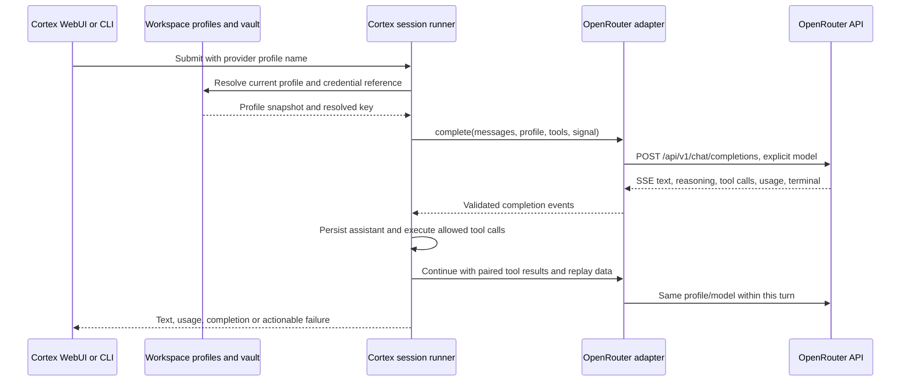

# Cortex OpenRouter integration: technical specification and implementation plan

Status: proposed; this document does not implement or enable the integration.

Prepared: 2026-09-06. Repository baseline: `e8996a6`, plus the working-tree changes present during inspection. In particular, the provider, retry, configuration, and runner code already contains uncommitted reliability changes. Reconcile the implementation against the eventual merged baseline instead of replacing those changes.

## 1. Objective and release scope

Allow a user to supply an OpenRouter API key, configure one or more OpenRouter model profiles in a Cortex workspace, select a profile in Cortex, and run the selected model through the normal conversation and tool execution flow.

The service requested as “OpenRouter.com” exposes its documented API at `https://openrouter.ai/api/v1`. Cortex must use that API host and an explicit model identifier. The existing Chat Completions protocol is suitable for this integration. [OpenRouter quickstart](https://openrouter.ai/docs/quickstart)

Required behavior:

1. A workspace can contain several named OpenRouter profiles, each with its own model ID and settings. Profiles may reference the same key or different keys.
2. Selecting a profile sends its exact configured model ID and resolved OpenRouter key to OpenRouter. A model change applies to subsequent turns.
3. Streaming text, cancellation, token accounting, supported image inputs, and Cortex tool calls work through the existing runner.
4. Tool calls and expert-panel requests retain the selected profile. The integration does not introduce expert-specific model pins or a new panel default.
5. Keys use Cortex's existing vault/environment-reference mechanism and remain outside configuration read responses, model prompts, logs, and committed files.
6. Invalid credentials, unavailable models, insufficient credits, unsupported capabilities, and interrupted responses produce actionable errors.
7. Existing native OpenAI, Anthropic, and local OpenAI-compatible profiles remain usable.

The first release targets the Node-hosted Cortex runtime, its WebUI, and CLI. A manually configured profile is the essential delivery path. Guided setup, catalog browsing, and diagnostics complete the supported integration; catalog access must never become a prerequisite for every chat request.

Deferred: the standalone browser-only bundle calling OpenRouter directly; OAuth/PKCE login; OpenRouter account or key administration; BYOK provisioning; Responses API; embeddings and Workspace RAG model replacement; audio/video/image generation; OpenRouter server tools and plugins; automatic model fallback; advanced routing optimizers; structured-output UI. Cortex's existing local tools and Workspace RAG remain the mechanisms used by conversations.

## 2. Current Cortex architecture and verified gaps

All paths in this document are relative to the repository root unless stated otherwise.

| Area | Inspected source | Current behavior and implication |
| --- | --- | --- |
| Provider contracts | `local-agent/matbot/packages/core/plugin-api/src/types.ts` | `ProviderConfig` contains `name`, `module`, `model`, `credentials`, `endpoint`, `parameters`, and optional `fallback`. `ProviderAdapter.complete()` returns `CompletionEvent` values. No new top-level provider system is needed. |
| Config loading | `local-agent/matbot/packages/core/config/src/loader.ts` | Native `providers` entries become a map. **`toModelParameters()` currently skips arrays and objects.** Nested `capabilities` and proposed OpenRouter options would disappear on restart. The legacy `language_models.openai_compatible` loader follows a different path and can retain capabilities. |
| YAML support | `local-agent/matbot/packages/core/config/src/yaml.ts` | A limited parser supports block mappings/sequences and leaves `${NAME}` unresolved. It does not support YAML anchors or flow objects. Use block syntax in examples and generated configuration. |
| Credentials and provider resolution | `local-agent/matbot/apps/cli/src/index.ts` | `resolveCredentials()` uses the vault. `resolveProvider()` resolves a named profile lazily and instantiates its registered adapter. The default vault is `EnvFileVault` beside the active config; plugins can replace it. |
| Environment loading | `local-agent/matbot/apps/cli/src/config.ts` | `loadDotEnv()` preserves variables already supplied by the real environment. Documentation must distinguish process environment changes from live vault updates. |
| Compatible adapter | `local-agent/matbot/packages/plugins/providers/openai-compat/src/adapter.ts` | Already supports configurable endpoint, Bearer key, exact `config.model`, streaming text/tool calls, temperature, output limits, caching opt-in, and usage tokens. It uses native `fetch`, not an SDK. |
| Request gaps | Same adapter | Does not send OpenRouter attribution, routing preferences, or unified reasoning options. Declared generic `topP` and `stopSequences` are not forwarded here. Its token-field heuristic is designed for direct providers, not a gateway protocol. |
| Response gaps | Same adapter and `src/convert.ts` | Reads `reasoning_content`, but not OpenRouter's `reasoning`/`reasoning_details`. The converter removes reasoning blocks from outgoing history. It ignores response cost and generation/model metadata. |
| Reliability baseline | `local-agent/matbot/packages/core/providers/_base/src/{http-retry,sse,completion-deadline}.ts` | Working-tree code already has bounded retries, cancellation, total/idle deadlines, and SSE buffering limits. `parseSSE()` skips comment lines, processes individual data lines, and returns at `[DONE]`; it does not expose whether completion ended by sentinel or EOF. |
| Tool safety | `local-agent/matbot/packages/core/runner/src/runner.ts` | The current runner requires a terminal `done`, retains incomplete output on error, and prevents pending tool execution from an unconfirmed completion. Preserve these guarantees. |
| Profile selection | `local-agent/matbot/packages/plugins/frontend/web/src/{server,plugin}.ts` and `static/app.js` | `GET /providers` returns profile names. The selector stores the chosen profile per workspace. It currently falls back to the first available name when a saved selection disappears. |
| Model editing | `local-agent/matbot/packages/plugins/runtime-admin/src/configuration.ts` | The `provider-models` contributor updates model strings, persists with a configuration version check, and changes the live map. It does not offer a vendor catalog or manage keys. |
| Profile administration | `local-agent/matbot/packages/plugins/runtime-admin/src/provider.ts` | The `provider` tool supports list/add/remove, prompts for credentials out of band, stores a vault reference, resolves adapter modules, and updates the live map. Its endpoint probe is an unauthenticated HEAD request, which does not verify credentials or inference. |
| Initial setup | `local-agent/matbot/apps/cli/src/index.ts` | Discovers provider packages, asks for model/endpoint/key, and writes configuration. Its generic key prompt is not masked. OpenRouter setup needs proper defaults and secret input. |
| Auxiliary model calls | `local-agent/matbot/plugins/expert-panel/src/index.ts`; `local-agent/matbot/packages/plugins/session-titler/src/index.ts` | Experts prefer an explicit expert pin, then the turn provider, then panel default. The titler uses an explicit valid `titlerProvider` when present, otherwise the caller's profile. Test both paths rather than assuming every LLM call is chat. |
| Health | Compatible adapter `health()` | Returns `ok` without network activity. This is adapter liveness, not proof that a key/model works. |

A basic OpenRouter request is structurally possible with today's compatible adapter. This is a code inspection finding, not a successful live inference test. A configuration-only release would leave reasoning replay, validation, diagnostics, and configuration round-trip gaps unresolved.

## 3. Architecture decision

Add a first-class provider package at:

`local-agent/matbot/packages/plugins/providers/openrouter/`

Proposed package name: `@matatbread/matbot-provider-openrouter`.

Use a small `OpenRouterAdapter` implementing the existing `ProviderAdapter` interface. Reuse the OpenAI-compatible conversion and streaming machinery through an explicit transport/dialect extension. Do not copy the full adapter and allow two implementations to diverge. Do not replace Cortex's runner with an OpenRouter agent SDK.

The OpenRouter package owns:

- API origin/path validation and OpenRouter defaults.
- OpenRouter-specific configuration validation and request fields.
- Catalog/key diagnostic helpers and normalized model metadata.
- Reasoning replay rules and response metadata interpretation.
- OpenRouter error classification and attribution settings.

The shared completion implementation continues to own HTTP lifetime management, common message/tool conversion, streaming text, tool argument assembly, and usage event delivery. Add dialect hooks/options with a conservative default that preserves the existing compatible adapter. Keep internal helper exports explicit in the package entry point; avoid importing another package's unexported source path.



The runtime resolves a profile once when executing a queued turn and retains that configuration snapshot through its tool loop. An edit affects turns resolved afterward, including already queued turns that have not started. If product behavior later requires submission-time snapshots, implement that explicitly in the queue contract; it is not part of this release.

## 4. Configuration contract

### 4.1 Existing-adapter bootstrap example

This uses fields accepted by the current loader and adapter. It illustrates the minimal path for a non-reasoning text model; it is not the target feature-complete configuration.

```yaml
providers:
  OpenRouter Chat:
    module: ./packages/plugins/providers/openai-compat
    endpoint: https://openrouter.ai/api/v1
    model: openai/gpt-4o
    credentials:
      apiKey: ${OPENROUTER_API_KEY}
    parameters:
      maxTokens: 4096
      tokenLimitParam: max_tokens
```

The model above is an illustrative identifier used in OpenRouter's documentation, not a recommendation or a guarantee of availability. Users must supply an available model ID and a real key outside this document. Authentication uses a Bearer token. [Authentication](https://openrouter.ai/docs/api_reference/authentication)

### 4.2 Target configuration after implementation

```yaml
default_provider: OpenRouter Chat

providers:
  OpenRouter Chat:
    module: ./packages/plugins/providers/openrouter
    model: openai/gpt-4o
    credentials:
      apiKey: ${OPENROUTER_API_KEY}
    parameters:
      maxTokens: 4096
      requestTimeoutMs: 60000
      streamIdleTimeoutMs: 120000
      completionTimeoutMs: 600000
      capabilities:
        tools: true
      openrouter:
        provider:
          require_parameters: true
          allow_fallbacks: true

  OpenRouter Reasoning:
    module: ./packages/plugins/providers/openrouter
    model: vendor/model-id-from-openrouter
    credentials:
      apiKey: ${OPENROUTER_API_KEY}
    parameters:
      maxTokens: 8192
      openrouter:
        reasoning:
          effort: medium
        provider:
          require_parameters: true
          allow_fallbacks: true
```

`vendor/model-id-from-openrouter` is an explicit placeholder and must be replaced. The new module path and nested options are proposed functionality. They will not work fully until the package and loader changes are implemented.

Examples assume the configuration lives at `local-agent/matbot/matbot.yaml`. For another workspace config location, resolve and serialize the module relative to that config file, using the existing loader/admin module-resolution helpers. Do not copy the displayed relative path blindly into a nested workspace directory. Provider modules are loaded from profile declarations; do not require users to duplicate the adapter in the `plugins` list.

`default_provider` is the existing YAML key for the default runtime profile. It applies when the entry point supplies no profile. The WebUI has its own saved selection; changing the default must not overwrite an explicit UI choice. Omit this line when adding OpenRouter without changing the user's default.

Store the actual credential in the active vault, the runtime's process environment, or the active configuration directory's local `.env`. The stored YAML contains `${OPENROUTER_API_KEY}`, never the value. One key reference may be shared by multiple profiles. A separate workspace-specific reference is appropriate when credentials differ by workspace. Merely setting the environment variable does not create or select a profile.

### 4.3 Fields and validation

| Field | Target behavior |
| --- | --- |
| Profile map key | Required, unique display/selection name. Preserve spaces. Reject line breaks, control characters, and unsupported YAML key forms with a useful error. |
| `module` | OpenRouter package specifier. Remains the authoritative adapter identity; model prefixes never choose a provider module. |
| `model` | Required trimmed, non-empty opaque ID; preserve case, slashes, suffixes, and internal punctuation. Reject control characters and URL-shaped values. Do not strip vendor prefixes or silently translate IDs. |
| `credentials.apiKey` | Required after vault resolution. Reject empty values and unresolved `${...}` strings before HTTP. Do not hard-code a key prefix or length. |
| `endpoint` | Optional; default `https://openrouter.ai/api/v1`. Accept that base or the full completion URL, with optional trailing slash. Reject unrelated paths. |
| `parameters.maxOutputTokens` | Optional positive integer; takes precedence over `maxTokens` to retain existing Cortex convention. |
| `parameters.maxTokens` | Positive integer; default 4096. Serialized to OpenRouter as `max_tokens`. |
| `parameters.maxContextTokens` | Optional positive integer metadata for existing context budgeting; never serialized as an API request field. |
| `parameters.maxCompletionTokens` | Existing metadata name; do not silently reinterpret as the requested output limit. |
| `parameters.tokenLimitParam` | For the new adapter, omit or accept `max_tokens`; reject a conflicting override with migration guidance. Existing compatible profiles keep their behavior. |
| `parameters.temperature` | Optional finite number in the documented range, currently 0–2; omitted unless configured and supported. |
| `parameters.topP` | Optional finite number greater than 0 and at most 1; serialize as `top_p`. |
| `parameters.stopSequences` | Optional bounded array of non-empty strings; serialize as `stop` only when supported. |
| `parameters.capabilities` | Validated object; preserve existing names such as `tools`, `images`, `parallel_tool_calls`, and `chat_completions`. |
| `parameters.openrouter.appTitle` | Optional short string; send as `X-OpenRouter-Title`. Omit by default. |
| `parameters.openrouter.httpReferer` | Optional explicitly configured public application URL; send as `HTTP-Referer`. Omit by default. Never derive it from a session or workspace URL. |
| `parameters.openrouter.provider` | Allowlisted routing object described below. |
| `parameters.openrouter.reasoning` | Optional validated object. Initially support `enabled`, `effort`, `max_tokens`, and `exclude`, only for compatible models. |
| Existing deadline fields | Reuse the working-tree contract: positive integer milliseconds, maximum 3,600,000. Defaults are shown above. |

OpenRouter documents both output-limit names. Using `max_tokens` consistently is a Cortex design choice that removes the direct-provider model-name heuristic from this gateway path. Validate against model capabilities and available context; do not send both limit fields. [Parameters](https://openrouter.ai/docs/api_reference/parameters)

Attribution headers are optional for inference. Current documentation prefers `X-OpenRouter-Title`; `X-Title` remains a compatibility alias. Attribution can make an application visible in OpenRouter rankings, so configuration is opt-in and never populated with private workspace information. [App attribution](https://openrouter.ai/docs/app-attribution)

### 4.4 Loader and serialization changes

Replace scalar-only parameter normalization with a bounded recursive JSON-compatible normalizer. Preserve arrays, mappings, booleans, strings, finite numbers, and null where a parameter schema permits it. Preserve existing numeric-string coercion for the known top-level numeric fields. Reject dangerous object keys such as `__proto__`, `constructor`, and `prototype`, excessive depth, and unsupported values.

Keep generic parsing separate from adapter validation: unrelated provider-specific objects must round-trip without being rejected merely because the OpenRouter schema does not recognize them. Within the OpenRouter namespace, reject unknown options rather than silently ignoring spelling errors. Unsupported explicit request settings must fail with the profile name and configuration path.

Use a serialization helper compatible with Cortex's YAML subset for profile creation and edits. Current string interpolation in `buildProviderBlock()`/`appendYamlFields()` is insufficient for arbitrary strings containing `#`, quotes, newlines, or nested sequence values. Support and test quoting that the parser actually understands, or reject values the supported subset cannot represent. Preserve unrelated configuration text and comments. Verify a write by parsing it and comparing the intended profile values.

Do not expand `${OPENROUTER_MODEL}` inside `model` implicitly: the current runtime resolves credential and endpoint references, not arbitrary model or parameter strings. Users select an actual model ID in configuration.

## 5. HTTP and request mapping

### 5.1 Endpoint and credential boundary

Use `POST https://openrouter.ai/api/v1/chat/completions` with JSON content and `Authorization: Bearer <resolved key>`. Normalize the supported endpoint forms once. Require HTTPS, the exact approved host, no URL user information, no query/fragment, and the expected path. Disable automatic redirects for authenticated calls; surface an unexpected redirect instead of forwarding a key.

The first release deliberately uses the official API origin. Test fixtures inject a transport/fetch implementation or an internal test-only endpoint dependency. They must not require a production “allow arbitrary host” option. An administrator needing a proxy can continue using the generic compatible adapter; a dedicated OpenRouter proxy contract can be designed separately.

Construct request fields through an allowlist. No generic object spread may override `model`, `messages`, `tools`, `stream`, credentials, or endpoint. Do not send `openai-organization` or vendor-direct credential headers on this path.

### 5.2 Request example and field ownership

```json
{
  "model": "openai/gpt-4o",
  "messages": [
    { "role": "system", "content": "You are the configured Cortex assistant." },
    { "role": "user", "content": "Hello" }
  ],
  "stream": true,
  "max_tokens": 4096,
  "provider": {
    "require_parameters": true,
    "allow_fallbacks": true
  }
}
```

The runner supplies messages and tool definitions. The selected profile supplies the model, credentials, output limit, and validated optional settings. Session requests specify a profile name, not arbitrary wire-level model or credential overrides.

For the new OpenRouter dialect, omit `stream_options.include_usage` and the legacy `usage.include` flag: current OpenRouter documentation says usage is automatic and those options are deprecated. Keep the generic adapter's usage-request behavior intact for endpoints that still need it. [Usage accounting](https://openrouter.ai/docs/cookbook/administration/usage-accounting)

### 5.3 Capabilities, tools, and attachments

Use the public model catalog for capability hints and operator feedback. Explicit profile restrictions win: `tools: false` creates a chat-only profile, and `images: false` forbids image submission. Catalog absence means unknown, not false. For an unknown manually entered model, allow an explicitly enabled capability and rely on strict upstream validation; show that support is unverified.

Resolve tool support in this order: explicit profile flag, known catalog support, then an attempted tool request with strict parameter enforcement when Cortex has tools to offer. Unknown capability therefore does not silently disable tools; a rejected request explains how to select a suitable model or configure chat-only operation. For unknown image support, require an explicit enabling flag before submitting images. Never fetch the catalog synchronously on every completion to make these decisions.

When tools are enabled, convert Cortex tool definitions to function tools and preserve tool IDs across assistant calls and subsequent `tool` messages. Continue to use Cortex's permission checks, schema validation, tool execution, and `is_error` corrective results. The model does not execute local tools itself. [Client tools](https://openrouter.ai/docs/guides/features/tool-calling)

Omit `tools`, `tool_choice`, and `parallel_tool_calls` together when there are no offered tools or the profile disables tools. Send `parallel_tool_calls` only when explicitly configured and supported. Preserve parallel call indexes and argument fragments. A text-only model can be selected for chat, but the UI must explain that tool-dependent tasks require another profile.

Validate inputs before conversion: supported image blocks use the existing image representation; reject unsupported image inputs instead of silently discarding them. Documents, audio, video, and stored file references do not gain native OpenRouter upload semantics through this feature. Continue existing Cortex extraction/context preparation where available; clearly report when only a filename placeholder would otherwise reach the model. Do not promise that Files-panel storage automatically supplies full file contents to a prompt.

Default `promptCache` to false. Retain it only as an advanced opt-in with fixtures for the intended model family; general prompt-cache UI is outside this release.

### 5.4 Routing and exact model selection

The first release sends one `model` and no fallback `models` list or `route` option. Do not set a Cortex profile `fallback` automatically. That existing field is not evidence of an implemented or appropriate fallback policy for OpenRouter.

Allowed OpenRouter routing fields initially:

| Field | Default and semantics |
| --- | --- |
| `require_parameters` | `true`; reject endpoints that cannot honor supplied parameters. |
| `allow_fallbacks` | `true`; permits eligible upstream provider alternatives for the selected model. |
| `order` | Optional non-empty array of exact upstream provider slugs, in preference order. |
| `only` / `ignore` | Optional explicit provider allow/deny lists. Reject contradictory lists locally. |
| `data_collection` | Optional `allow` or `deny`; omission retains the user's OpenRouter policy. |
| `zdr` | Optional boolean; expose only with clear policy-specific help and validated API support. |

OpenRouter distinguishes provider routing from model fallback. `require_parameters: true` prevents unsupported request options from being ignored by a chosen endpoint. Routing restrictions can leave no eligible provider; report that result without relaxing the restrictions. [Provider selection](https://openrouter.ai/docs/guides/routing/provider-selection)

Treat router IDs and moving aliases as explicit advanced choices. Accept valid opaque IDs, but explain that a router or moving alias can resolve to a different underlying model. Preserve both the requested ID and returned model in diagnostics. Never silently replace a retired ID with a “latest” alias. If the user needs a stable model, guide them to a concrete catalog ID without claiming immutable infrastructure behind it.

## 6. Streaming, reasoning, and completion integrity

### 6.1 SSE behavior

OpenRouter streams may include comment heartbeats, a terminal usage frame repeating the finish reason, and an error frame under HTTP 200. The parser/adapter must support those shapes and must not identify success from HTTP status alone. [Streaming](https://openrouter.ai/docs/api_reference/streaming)

Extend the shared parser in a backward-compatible way, or add an OpenRouter wrapper, to expose event framing and terminal detection. Assemble multiple `data:` lines according to SSE framing, preserve UTF-8 across byte boundaries, accept LF/CRLF, and retain existing cancellation/buffer bounds. Ignore comments and unrelated fields. A comment is transport activity, not proof of model progress: it must not reset the completion's useful-output idle deadline indefinitely.

OpenRouter completion state machine:

1. Before headers: bounded request/retry deadline.
2. Receiving: collect text and reasoning; accumulate tool calls without executing them.
3. Terminal choice: record `stop`, `tool_calls`, or `length`; continue reading accounting/error frames. Accept a repeated identical finish reason with empty content.
4. Confirmed stream end: require the OpenRouter sentinel and a valid terminal choice. Only then release completed tool-call events and `done`. A premature EOF, malformed JSON, contradictory terminal frame, or late error fails the completion.

Treat `content_filter` and `error` as failures with a clear reason. For `length`, retain the partial answer and mark truncation; retain the existing malformed-tool-arguments correction mechanism. Invalid/missing tool IDs or names fail validation rather than becoming executable calls. If a stream fails after partial output, keep that output visibly incomplete, do not execute pending calls, and do not automatically replay it.

Add typed, optional completion metadata for finish reason/truncation and generation identity, consumed by the runner and UI. Prefer one additive event such as `completion-metadata` over encoding operational status into assistant text. Update exhaustive switches and trace serialization. This is a small contract extension, not a change to tool execution semantics.

Proposed additive event payload:

```typescript
type CompletionMetadataEvent = {
  type: 'completion-metadata';
  gateway: 'openrouter';
  requestedModel: string;
  returnedModel?: string;
  generationId?: string;
  upstreamProvider?: string;
  finishReason?: string;
  truncated?: boolean;
};
```

Metadata events may update a request's earlier metadata; they do not imply success. Persist the merged safe fields in assistant-message metadata and include them in the existing trace, including known generation identity on failure. Preserve the original requested profile/model in traces after later configuration edits.

### 6.2 Reasoning continuity

OpenRouter can return `reasoning`, its `reasoning_content` alias, and structured `reasoning_details`. Structured details can include signed or encrypted values; preserving their original sequence matters when sending tool results back. [Reasoning tokens](https://openrouter.ai/docs/guides/best-practices/reasoning-tokens)

Implement these Cortex-specific rules:

- Parse structured details independently from user-visible text. Prefer `reasoning` over its alias if both carry the same fragment, avoiding duplicate UI output.
- Preserve the complete ordered reasoning detail sequence without summarizing, rewriting, interpreting encrypted data, or dropping signatures and unknown fields. Add fixtures for repeated IDs/indexes and split payloads; follow the documented delta semantics instead of guessing from field names.
- Use the existing `unknown-block` to `unknown-content` persistence path for an opaque block named `openrouter.reasoning.v1`. Its typed internal payload contains protocol version, requested model, returned model when known, API origin, and replay data. It contains no API key.
- The OpenRouter converter recognizes this block and restores the assistant message's replay fields. Other adapters continue ignoring it. Ensure ordinary OpenRouter messages still preserve the assistant tool-call IDs and tool result pairing.
- Prefer complete structured details for replay when present; retain a plain reasoning field for string-only responses. Test models that emit both representations to ensure duplicate data is not sent.
- Replay only to a compatible OpenRouter conversation context on the same API origin and model identity. On a profile/model switch, never forward another vendor's opaque reasoning. For moving aliases whose underlying identity changes, require a new compatible context instead of assuming a signed block is portable.
- Persist/reload these blocks through all supported session stores. Compaction must preserve a complete pending assistant/tool exchange with its replay data, or summarize/remove the completed exchange as a unit. It must not retain tool results while severing required replay context.
- Treat opaque reasoning as protocol data. Do not render raw encrypted blocks, include them in general logs, or allow generic unknown-content rendering to expose them. Check session export and observability handling explicitly.

Reasoning configuration is optional. Validate `effort` against a maintained supported enum and model metadata; reject simultaneous `effort` and `max_tokens` in this initial contract. A configured reasoning token budget must leave room inside the output cap for an answer. Reject conflicting `enabled: false` plus an effort/budget. Do not assume excluding visible reasoning disables reasoning computation or cost.

Reasoning round-trip tests are a release requirement before advertising reasoning models with tools. A narrower preliminary release may support tested text/tool models, but must label reasoning/tool support incomplete.

## 7. Usage, errors, and observability

### 7.1 Usage accounting

Map provider usage into the existing Cortex `usage` event:

| OpenRouter value | Cortex value / rule |
| --- | --- |
| `prompt_tokens` | Total input before cache partitioning. |
| `prompt_tokens_details.cached_tokens` | `cacheReadTokens`; validate as a non-negative count. |
| `prompt_tokens_details.cache_write_tokens` | `cacheCreationTokens` when available; partition from fresh input only after validating counts against total input. |
| Prompt total minus cache-read and cache-write subsets | `inputTokens`; preserve the invariant that fresh input + cache read + cache creation equals total input. Flag inconsistent counters instead of manufacturing negative counts. |
| `completion_tokens` | `outputTokens`, including any reasoning tokens already counted there. |
| `completion_tokens_details.reasoning_tokens` | Optional diagnostic breakdown; never add it to output again. |
| `cost` | `costUsd` for OpenRouter account consumption; preserve missing as unknown and zero as a real zero. |

These response counters and account cost are described by OpenRouter's usage documentation; its credit system is denominated in USD. This is inference consumption, not a complete accounting of credit-purchase fees or independently billed BYOK charges. [Usage accounting](https://openrouter.ai/docs/cookbook/administration/usage-accounting), [OpenRouter support](https://openrouter.ai/support)

The runner adds usage events, so emit final totals once per provider request. If intermediate cumulative usage appears, normalize it to one final total or incremental deltas; do not add cumulative snapshots repeatedly. Add tests for missing counters, repeated accounting frames, cache combinations, and zero-cost responses. On failure after usage was received, retain known usage with an incomplete/failure status. The current runner initializes its cost accumulator to zero; add a separate known-cost flag so traces and UI do not report an unknown OpenRouter cost as a verified zero.

### 7.2 Error policy

Introduce an OpenRouter error type with safe fields: HTTP status, API code, normalized error category when supplied, bounded scrubbed message, generation ID, retry hint, and whether any output was received. Check both top-level errors and any documented choice-level error shape. Never log the raw upstream body or moderation metadata that may contain prompt excerpts. [Errors and debugging](https://openrouter.ai/docs/api_reference/errors-and-debugging)

| Condition | User-facing action | Automatic retry |
| --- | --- | --- |
| Missing/unresolved key | Configure or unlock the named credential reference. | None; no request. |
| 400/404/422 or invalid model/parameters | Correct model ID, limits, or the indicated option. | None. |
| 401 | Replace/reselect the OpenRouter key. | None. |
| 402 | Check OpenRouter account credits and per-key cap. | None. |
| 403 | Inspect account/routing/permission restrictions. | None; do not weaken policy. |
| 408/429/500/502/503/504 before accepted stream | Report transient timeout/rate limit/availability; preserve retry hint. | Bounded retry under the request deadline. |
| Unexpected redirect or disallowed URL | Correct endpoint configuration. | None. |
| SSE error, malformed stream, EOF, or failure after partial output | Show failure with partial output marked incomplete. | None. |
| User cancellation | Mark cancelled and stop local processing. | None. |

Reuse the existing three-attempt ceiling and cancellation-aware backoff. Add jitter if necessary. The current retry helper clamps `Retry-After` to 60 seconds, which could retry earlier than a longer server instruction. For OpenRouter, honor the full delay only when it fits the remaining request budget; otherwise stop and return a retryable error with the hint. Do not shorten the server's requested wait to fit the budget. Test both seconds and HTTP-date values.

Do not claim exactly-once billing: a network failure before Cortex receives headers can leave upstream completion status ambiguous. Keep retries bounded and never retry a partially delivered completion automatically. Local cancellation always stops the Cortex request/tool loop; upstream cancellation and billing behavior depend on the provider. [Stream cancellation](https://openrouter.ai/docs/api_reference/streaming)

### 7.3 Diagnostics and health

Keep adapter liveness separate from authenticated readiness. Do not make routine `/health` checks generate completions.

Provide explicit diagnostic levels:

1. Configuration: validate fields and credential resolution locally.
2. Key check: authenticated `GET /api/v1/key`, bounded by a short timeout.
3. Model check: catalog lookup and capability comparison.
4. Inference test: a user-initiated small completion with the configured profile and an explicit output cap; indicate that it consumes quota/credits.

`GET /api/v1/key` can validate the key and return its cap/remaining allowance; it does not prove the chosen model can complete a request. A null per-key limit is not a zero balance and is not proof of unlimited account funds. [Limits](https://openrouter.ai/docs/api_reference/limits)

Diagnostic responses expose only booleans/status, timestamps, model/profile IDs, safe limits, and scrubbed errors. Set no-store caching on credential/account responses. Cache successful key checks briefly by workspace, credential reference, and credential revision; invalidate them on key/profile edits. A health failure for OpenRouter must not disable unrelated providers.

Use existing trace correlation and add `gateway=openrouter`, profile name, requested/returned model, generation ID, finish reason, duration, time to first token, retry count, token breakdown, and known cost. Record actual upstream provider only if returned by the API; never infer it from a model vendor prefix or the `openai-compat` class name. Detailed generation lookup is an explicit support action, not an extra API call after every completion.

## 8. Model discovery and user configuration flow

### 8.1 Catalog service

Add a server-side catalog helper that reads `GET /api/v1/models`. Consume `data[].id`, display name, input/output modalities, supported parameters, context length, output ceiling, and optional pricing. Model IDs must come from the API or manual entry rather than a hard-coded list. The catalog is descriptive and does not guarantee an individual account can invoke every entry. [Model catalog](https://openrouter.ai/docs/guides/overview/models), [Models API](https://openrouter.ai/docs/api/api-reference/models/list-all-models-and-their-properties)

Proposed operational defaults: ten-minute memory cache, fifteen-second fetch deadline, one shared in-flight refresh per API origin, bounded response size, and manual refresh. These are Cortex design defaults, not OpenRouter limits. Use public catalog access without credentials where supported. Do not partition a public cache by raw key or attach credentials unnecessarily.

Keep the last successful catalog on transient failures and label it stale. Allow manual IDs and retain saved profiles even when absent from the catalog. Never delete profiles or block startup because catalog discovery is unavailable. If pagination is used, validate next-page URLs against the same origin/path, bound page counts, and publish a refreshed cache only after complete discovery. Treat names/descriptions as untrusted display data and render as text.

Normalize optional data explicitly: unknown capabilities are not false; missing price is not free; missing output limit is not unlimited. Pricing is informational with a fetch timestamp; final request usage is authoritative. Model selection remains available without displaying prices.

### 8.2 Reuse Cortex administration surfaces

Extend the existing runtime-admin provider tool with an optional `preset: 'openrouter'` for `add`. The preset supplies module/endpoint/defaults; model and profile name remain explicit. Preserve the generic action shape for existing callers. Extend initial CLI setup to select the same preset and collect keys with masked input or an existing credential reference. Initialization must work before any LLM is available.

Add an `openrouter-profiles` configuration contributor and UI contribution under runtime-admin, reusing the existing configuration-admin and tool transport. Do not invent an unrelated REST administration service. Proposed actions exposed through a small `openrouter` administration tool/service:

```typescript
type OpenRouterAdminAction =
  | { action: 'models'; refresh?: boolean }
  | { action: 'validate'; profile: string; expectedVersion: string;
      mode: 'configuration' | 'key' | 'model' | 'inference' };
```

Profile creation/removal uses the extended `provider` tool. Profile edits use the contributor with `expectedVersion`. Credential entry uses the vault's out-of-band password prompt, never the action arguments. The configuration contributor contains credential references and non-secret options only. Shared helpers must prevent divergence between `provider-models`, `openrouter-profiles`, CLI setup, and the provider tool.

The UI flow is:

1. Add provider → OpenRouter.
2. Choose an existing key reference or enter a key in a password field.
3. Search available text models, optionally filter for tools/images/reasoning, or enter an exact ID.
4. Review profile name, selected ID, output limit, and optional advanced settings.
5. Save; show local validation status and offer the separate key/model/inference checks.
6. Select the profile in the existing conversation selector and submit a turn.

The WebUI sends credential input only to its Cortex host's existing secret channel. It does not call OpenRouter directly or store keys in browser local storage. Profile names and non-secret preferences may remain in local storage as today.

### 8.3 Atomic edits and selection semantics

All profile writers must use the configuration version/atomic-replacement helpers. Validate before persisting; update the live provider map only after a successful write. A stale edit returns a conflict and leaves file/live state unchanged. Profile edits invalidate capability/diagnostic caches. Preserve unrelated profiles, defaults, plugins, workspace data, and comments.

Adding a profile must not change the selected provider automatically. Editing its model invalidates incompatible capability/reasoning settings or asks the user to correct them before saving; do not retain a previous model's metadata as authoritative. Expose the model ID alongside the profile name in administration and optionally as selector help text.

For this integration, replace the selector's silent first-profile substitution when an explicitly saved profile has been removed with a “select a provider” state. Otherwise removing OpenRouter could unexpectedly send the next prompt to another service. Initial setup with no prior selection can retain the current default behavior. Test this small shared UI change against existing provider-removal scenarios.

Workspace switching must discard stale catalog/validation responses from the previous workspace and keep profile selections separate. Resolve credentials through the active workspace vault. Never use another workspace's key as a fallback; deliberate sharing through a process-level environment variable remains an explicit operator choice.

## 9. File-by-file implementation plan

| File or directory | Planned work |
| --- | --- |
| `local-agent/matbot/packages/plugins/providers/openrouter/package.json`, `tsconfig.json`, `src/index.ts` (new) | Register the package and plugin, declare Node runtime support, export adapter and explicit shared service contracts. Mirror existing package conventions. |
| New package `src/{adapter,config,models,diagnostics,errors}.ts` | OpenRouter dialect, validation, endpoint policy, catalog normalization, key/model probes, typed safe errors. Split further only where tests benefit. |
| `local-agent/matbot/packages/plugins/providers/openai-compat/src/{adapter,convert,index}.ts` | Extract/reuse transport hooks and conversion options. Keep default compatible behavior unchanged; OpenRouter supplies its own request and replay policy. |
| `local-agent/matbot/packages/core/config/src/loader.ts` | Recursive parameter normalization and validation; preserve legacy/native precedence. |
| `local-agent/matbot/packages/core/config/src/yaml.ts` | Only the quoting/serialization compatibility corrections required for reliable profile round-trips; no broad YAML replacement without separate justification. |
| `local-agent/matbot/packages/core/providers/_base/src/{sse,http-retry,completion-deadline,index}.ts` | Terminal-aware SSE support, respectful retry hints, and reuse of existing deadlines; regression-test shared behavior. |
| `local-agent/matbot/packages/core/plugin-api/src/types.ts` | Add typed optional completion metadata for generation/model/finish status. Reuse existing opaque block events for reasoning persistence. |
| `local-agent/matbot/packages/core/runner/src/runner.ts` | Consume metadata, persist truncation/failure state, keep usage and tool confirmation rules. |
| `local-agent/matbot/packages/core/runner/src/session-runner.ts` | Verify profile snapshots, queue behavior, resume, and provider-switch handling; change only if tests reveal a contract gap. |
| `local-agent/matbot/packages/plugins/runtime-admin/src/{provider,configuration,index,ui}.ts` and `src/ui-module.js` | Shared profile writer, preset, model/key diagnostics, configuration contributor and UI. Respect the existing JS UI module layout; do not create a second module with the same role. |
| `local-agent/matbot/apps/cli/src/index.ts` | Setup defaults, masked credential input, and shared preset/helper wiring. Package discovery already scans provider directories. |
| `local-agent/matbot/packages/plugins/frontend/web/src/{plugin,server}.ts` | Keep `GET /providers` backward compatible; add optional safe model/adapter metadata only if used by the UI. |
| `local-agent/matbot/packages/plugins/frontend/web/static/app.js` and rendered status helpers | Selection invalidation, optional profile/model display, truncation metadata presentation. |
| Session store/conversion/compaction consumers located during implementation | Preserve opaque blocks and paired exchanges; test every changed exhaustive content switch. Avoid a storage schema migration if existing JSON content is sufficient. |
| `local-agent/matbot/plugins/expert-panel/src/index.ts`; `local-agent/matbot/packages/plugins/session-titler/src/index.ts` | Primarily regression coverage for inherited profile and explicit titler override; no new production pins. |
| `local-agent/matbot/pnpm-lock.yaml` and dependent package manifests | Add only dependencies required by the new workspace package/helper use. Existing workspace globs already cover the provider directory. |
| `local-agent/config/matbot.openrouter.example.yaml` (new), `local-agent/matbot/.env.example`, `docs/configuration.md`, `README.md`, `docs/testing.md` | Safe examples, setup/selection instructions, limitations, diagnostics, test inventory, and operational guidance. |
| `tests/openrouter-*.test.mjs`, `tests/webui/openrouter.spec.mjs` (new) | Contract, local HTTP/SSE fixtures, administration, persistence, and WebUI coverage. |
| `tests/openrouter-live.integration.mjs` and optional `test:integration:openrouter` script (new) | Explicitly gated live smoke lane outside `test:all`. |

The browser-only files `apps/web-bundle/src/{setup,bootstrap,provider-tool}.ts` and runtime-admin `browser-provider.ts` are a separate runtime. Do not advertise OpenRouter there or mark the new package browser-compatible until key storage, CORS, packaging, and replay behavior are implemented and tested for that runtime.

## 10. Delivery phases and gates

### Phase 1 — Contracts and configuration

Finalize the schema above, add the package scaffold, correct nested parameter loading and serialization, and create fake-key fixtures. Preserve current dirty work and capture the implementation baseline. Gate: configuration survives load/save/reload with exact model/key references and no unrelated edits.

### Phase 2 — Completion transport

Add the OpenRouter dialect, endpoint/key checks, explicit model mapping, common sampling fields, strict routing, tools, SSE terminal confirmation, retries, and cancellation. Gate: local mock server verifies request bytes and complete tool round-trips; failure fixtures execute no tools.

### Phase 3 — Reasoning and accounting

Implement opaque reasoning replay, metadata persistence, usage/cost normalization, truncation display, and session reload/switch tests. Gate: a streamed reasoning-plus-tool exchange survives persistence and sends the correct continuation; repeated usage is counted once.

### Phase 4 — Configuration experience

Implement the preset, masked key flow, catalog cache, diagnostics, workspace UI, atomic edits, and selection invalidation. Gate: a user can add OpenRouter without a functioning existing LLM, select it, edit the model, and rotate the key without exposing credentials.

### Phase 5 — Regression and opt-in verification

Run focused suites, typecheck, and the complete normal regression suite. Perform separately authorized live smoke tests with an operator-supplied key and model. Update examples and limitations from observed results. Gate: acceptance matrix below passes, with skipped external tests reported separately from verified integration.

Dependencies: Phase 1 precedes all target nested configurations; Phase 2 precedes reasoning/live completion tests; Phase 3 precedes claims of reasoning/tool support; Phase 4 relies on the same validated contracts. Do not allow the catalog UI to delay manual-profile transport tests.

## 11. Test specification and acceptance criteria

Use deterministic fake credentials and local HTTP/SSE fixtures for normal tests. Assert behavior at the API, session, and UI boundaries rather than matching implementation source strings.

| ID | Scenario | Required result |
| --- | --- | --- |
| OR-01 | Parse native nested parameters and block arrays; save/reload. | Capabilities, routing, reasoning, stop sequences, numeric values, and `${KEY}` survive exactly. |
| OR-02 | Missing/blank key, unresolved reference, invalid host/path, redirect. | Useful error; no credential-bearing request reaches an unauthorized target. |
| OR-03 | Two profiles share one key and use different models. | Each selected profile sends its exact model ID; no vendor prefix stripping or default-model substitution. |
| OR-04 | Base/full endpoint and trailing-slash forms. | Exactly one `/api/v1/chat/completions` path. |
| OR-05 | Output limits, top-p, temperature, stop, optional attribution. | Correct wire names; omitted unsupported defaults; no duplicate token-limit fields or direct-provider organization header. |
| OR-06 | Byte-split UTF-8, LF/CRLF, multiline SSE, comments, usage-only/repeated-terminal frames. | Text intact; no comment parse errors; completion confirmed once. |
| OR-07 | Malformed JSON, missing terminal/sentinel, content after terminal, HTTP-200 error, trailing error. | Failed/incomplete turn; pending tools never execute. |
| OR-08 | Single/multiple streamed tool calls with split arguments; tool failure; malformed/truncated arguments. | Stable IDs, correct pairing, existing corrective results, and exactly one local execution per accepted call. |
| OR-09 | Tools disabled or known unsupported; images unsupported. | Chat-only behavior is clear; no invalid tool fields or silent attachment loss. |
| OR-10 | Reasoning strings, aliases, signed/encrypted details; store/reload; compaction boundary. | Correct ordered replay, no duplication, no reasoning loss during pending tool exchanges, no raw opaque rendering. |
| OR-11 | Switch to another model/provider in the same session. | No incompatible reasoning replay; ordinary visible history remains usable. |
| OR-12 | Final usage with cache read/write/reasoning/cost; repeated or missing accounting. | Totals obey the cache partition invariant; no double-counted output or cost; missing cost remains unknown. |
| OR-13 | 401/402/403/invalid model. | No automatic retries; correct user action. |
| OR-14 | 429/503 with short/long/date Retry-After; network failures; cancel during wait. | Bounded attempts, no early retry against hint, cancellation clears timers/listeners. |
| OR-15 | Hung headers, idle stream, heartbeat-only stream, total deadline. | Finite failure under configured budget; no hidden request or tool continuation. |
| OR-16 | Public catalog offline/stale/partial/paginated/malformed; manual model ID. | Saved profiles preserved; discovery failure does not block startup or manually configured chat. |
| OR-17 | Key check succeeds but model inference fails; null key cap. | Separate status indicators; no false “model verified” or zero-balance claim. |
| OR-18 | Config conflict, failed disk write, quoting-sensitive profile fields. | No partial live update; unrelated YAML preserved; conflict can be retried after refresh. |
| OR-19 | Add, edit model, remove selected profile, reload, switch workspace, rotate key. | Correct profile/model/key per workspace; explicit reselection after removal; no stale response cross-over. |
| OR-20 | Chat, experts, synthesis, background/consultation consumers, titler. | Selected profile propagates where inherited; an existing explicit titler override remains observable and respected. |
| OR-21 | Logs, trace events, configuration get/history, errors, browser storage. | No fake key value appears; opaque reasoning stays out of ordinary logs/UI. |
| OR-22 | Existing OpenAI, Anthropic, local-compatible fixtures and provider removal tests. | Existing behavior passes except the intentional explicit-reselection change, whose expectations are updated. |

Use and extend existing tests where appropriate: `tests/config-hardening.test.mjs`, `tests/core-hardening.test.mjs`, `tests/provider-reliability.test.mjs`, `tests/expert-panel-provider-fallback.test.mjs`, `tests/expert-panel-ui-provider-config.test.mjs`, and `tests/webui/matbot-webui.spec.mjs`. Some are currently modified or untracked; integrate with that work instead of overwriting it.

Proposed focused commands, after the named new files exist, from the repository root:

```powershell
node --test tests/openrouter-config.test.mjs tests/openrouter-adapter.test.mjs tests/openrouter-admin.test.mjs
node --test tests/provider-reliability.test.mjs tests/expert-panel-provider-fallback.test.mjs tests/expert-panel-ui-provider-config.test.mjs
npx playwright test tests/webui/openrouter.spec.mjs --project=chromium
corepack pnpm -C local-agent/matbot typecheck
npm run test:all
git diff --check
```

`npm run test:all` currently means Node tests, CLI tests, then Playwright WebUI tests. Live README QA and Docker/CUDA tests are separate lanes; this feature does not require enabling them merely to reach OpenRouter. Report actual current test results and skips rather than copying historical counts.

The proposed live lane requires all of `CORTEX_OPENROUTER_INTEGRATION=1`, `OPENROUTER_API_KEY`, and `OPENROUTER_TEST_MODEL`. If any prerequisite is absent, exit successfully with an explicit skipped result **before network, browser, or runtime startup**. Do not load a developer's workspace `.env` implicitly. Use an isolated temporary workspace, a bounded token budget, a tiny text request, and an optional deterministic harmless tool round-trip. A separate supplied reasoning-capable model enables the reasoning smoke case. Keep this lane outside normal CI and redact all artifacts. No key or live inference was used while preparing this specification.

## 12. Operations, rollout, and rollback

Ship the new provider package and safe example without enabling a profile in existing workspaces. Existing `openai-compat` OpenRouter profiles continue working with their current behavior. Migration is explicit: switch the profile's module to OpenRouter, retain name/model/key reference, remove conflicting direct-provider options, validate nested settings, and run diagnostics.

For manual YAML edits, restart the relevant Cortex runtime using the existing documented run flow so it reloads configuration and environment. For supported live edits, update the map after successful persistence and apply changes at the next turn boundary. Rotating a process environment variable requires restarting the process; a vault-managed key update follows the active vault's behavior. Do not promise cross-workspace isolation for a deliberately shared process environment key.

Rollback is profile-scoped: select a working existing profile, remove or migrate only the affected OpenRouter profile, and retain session data. Do not downgrade shared parser/runner changes independently of dependent code. Reasoning blocks must remain safely ignorable by older/non-OpenRouter adapters; do not delete historical messages to roll back.

Repository constraints apply throughout implementation: never stage or commit `local-agent/matbot/cortex-workspaces.json` or anything beneath `local-agent/matbot/workspaces/`. These are local user state, even if already tracked. Implement defaults in tracked templates/runtime code. Before any future commit, inspect explicitly staged paths and perform the AGENTS.md workspace-local audit. This specification requires no staging, commit, credential changes, or runtime restart.

Release completion means: a user can configure a key reference and exact model, select that profile, complete a streamed conversation and supported tool loop, change models predictably, and diagnose failures; required deterministic tests pass, live results are truthfully labeled, and unrelated providers/workspaces remain functional.

## 13. Evidence and specification validation

Repository claims above were checked against source files in the working tree on the preparation date. External protocol references are official OpenRouter documentation linked beside the relevant requirements; model catalogs, availability, headers, and routing capabilities should be rechecked when implementation begins.

Document checks performed: the bootstrap YAML parsed through the current `parseConfig()` and retained its model, credential placeholder, and output-field override; the target YAML parsed through `parseYaml()` and retained its proposed nested structure; the HTTP JSON example parsed successfully; Markdown fences, trailing whitespace, and all 22 unique acceptance IDs were checked. Target nested configuration was checked for syntax only because the loader fix is still proposed. Application regression suites and live inference were not run for this documentation-only change.

The key remaining implementation uncertainties are model-specific reasoning delta behavior, model capability changes between discovery and inference, and serialization/persistence behavior across every supported session backend. The fixtures and release gates explicitly address these. No paid endpoint call is necessary to validate the document itself, and no successful live integration is claimed by this plan.
