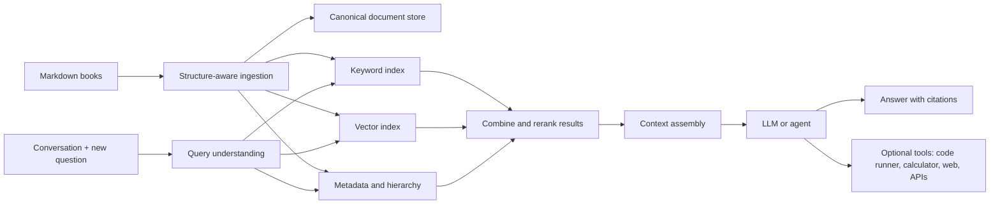

# Using a Large Technical Book Library with a Chatbot or Agent

The most effective approach is a **citation-first, hierarchical retrieval-augmented generation (RAG) system**. Do not place all the books in the model's prompt, and do not begin by fine-tuning a model on them. Instead, build a searchable knowledge layer that supplies the model with the right passages for each turn.



## Essential Systems

| System | Purpose |
|---|---|
| Markdown ingestion pipeline | Parses books while preserving headings, code blocks, tables, lists, and relationships between sections |
| Canonical document store | Retains the original Markdown and stable source locations |
| Full-text search | Finds exact API names, commands, error messages, acronyms, and identifiers |
| Vector search | Finds conceptually related passages even when terminology differs |
| Metadata store | Tracks book, edition, chapter, subject, technology, version, date, and permissions |
| Reranker | Examines initial search results more carefully and puts the genuinely relevant passages first |
| Retrieval orchestrator | Converts the conversation into searches, applies filters, and retrieves more context when necessary |
| LLM | Synthesizes an answer from the retrieved evidence |
| Conversation memory | Tracks the user's current project and prior references without treating the entire transcript as a search query |
| Evaluation and observability | Measures retrieval quality, citation accuracy, latency, cost, and hallucinations |

## Ingest the Books Structurally

Markdown is especially useful because it already contains hierarchy. Preserve:

```text
Book
  └── Chapter
       └── Section
            ├── explanatory passages
            ├── code examples
            ├── tables
            └── warnings or notes
```

Create searchable chunks at multiple levels:

- Small passages, approximately 500–1,000 tokens, for precise questions.
- Whole sections or expanded parent passages for explanations requiring context.
- Chapter and book summaries for broad questions such as “compare the concurrency models described across these books.”
- Separate representations for code examples, definitions, commands, and error messages.

Each chunk should include a heading breadcrumb such as:

```text
Designing Data-Intensive Applications
> Replication
> Problems with Replication Lag
> Reading Your Own Writes
```

Also attach metadata such as edition, publication date, programming language, library version, difficulty, and source anchor. Avoid splitting code blocks or tables arbitrarily.

## Use Hybrid Retrieval

Vector similarity alone is not enough for technical material. It can miss exact strings such as `SQLSTATE 40001`, `std::memory_order_acquire`, or a particular method name. Keyword search alone misses conceptual equivalence.

Run both:

1. Full-text/BM25 search for exact terminology.
2. Dense-vector search for semantic similarity.
3. Merge the rankings.
4. Rerank the best 30–100 candidates with a cross-encoder or reranking model.
5. Give the LLM perhaps 6–15 strong passages, expanding their parent or neighboring sections when context is needed.

Elastic's guidance recommends hybrid full-text and vector retrieval combined through reciprocal-rank fusion. See the [Elastic hybrid-search documentation](https://www.elastic.co/docs/solutions/search/hybrid-search). Dedicated reranking models are designed to reorder the output of an existing search system using the query and candidate documents together. See the [Cohere reranking documentation](https://docs.cohere.com/v2/docs/rerank).

## Make Retrieval Conversation-Aware

The retrieval query should not simply be the most recent message or the complete transcript. A small query-planning step should derive something like:

```json
{
  "question": "Why would the transaction still fail after retrying?",
  "context": "User is implementing PostgreSQL serializable transactions in Go",
  "exact_terms": ["serialization_failure", "SQLSTATE 40001"],
  "filters": {
    "technologies": ["PostgreSQL", "Go"],
    "prefer_recent_editions": true
  },
  "needs": ["explanation", "implementation pattern"]
}
```

The system can then issue multiple searches—for the underlying concept, the exact error, and implementation guidance—and retrieve again if the first evidence is insufficient.

Keep two kinds of memory separate:

- **Conversation memory:** what the user is building, decisions already made, and preferences.
- **Book knowledge:** retrieved afresh from the corpus, with citations.

## Add Hierarchical and Iterative Retrieval

A strong technical assistant needs several retrieval modes:

- **Precise lookup:** “What does this flag do?”
- **Conceptual explanation:** retrieve several supporting sections.
- **Comparison:** collect evidence from multiple books and editions.
- **Multi-step diagnosis:** decompose the problem into subquestions and retrieve for each.
- **Broad synthesis:** search chapter summaries first, then drill into supporting passages.
- **Unanswerable detection:** say that the library does not contain sufficient evidence.

A knowledge graph can help when questions depend heavily on relationships—prerequisites, subsystem dependencies, algorithms, authors' competing positions, or technology-version compatibility. It is an enhancement, not a prerequisite. GraphRAG systems commonly distinguish local entity-oriented retrieval from more expensive corpus-wide synthesis. See [Microsoft GraphRAG query methods](https://github.com/microsoft/graphrag/blob/main/docs/query/overview.md).

## A Sensible Initial Technology Stack

For hundreds of books, the corpus is not exceptionally large by search-engine standards. A relatively simple stack can work well:

- Markdown AST parser and background ingestion workers.
- PostgreSQL for metadata and canonical records.
- PostgreSQL full-text search plus `pgvector`, or Elasticsearch/OpenSearch for stronger integrated hybrid search.
- An embedding model.
- A cross-encoder or hosted reranking model.
- An LLM API with tool calling.
- Redis or an equivalent cache for repeated searches.
- An evaluation dataset and retrieval trace store.

A managed alternative is OpenAI File Search/vector stores, which support Markdown, configurable chunking, file attributes, and attribute filtering. This is a fast way to validate the idea before building a custom retrieval service. See [OpenAI File Search](https://developers.openai.com/api/docs/guides/tools-file-search) and the [OpenAI Retrieval guide](https://developers.openai.com/api/docs/guides/retrieval).

## What Not to Do

- Do not send entire books to the model on every request.
- Do not rely on vector search alone.
- Do not discard chapter and section structure during chunking.
- Do not treat fine-tuning as a knowledge database.
- Do not allow citations to be generated from memory; citations should refer to retrieved source IDs.
- Do not mix old and new editions without recording version and publication metadata.
- Do not add a knowledge graph until evaluation shows that ordinary hierarchical retrieval is insufficient.

Fine-tuning can later improve response style, tool selection, domain vocabulary, or workflow behavior. It should not replace retrieval for facts that must remain updateable, inspectable, and attributable.

## Recommended Rollout

Start with 10–20 representative books and a test set of roughly 100 real questions. Measure:

- Was the correct passage present in the top results?
- Did reranking improve its position?
- Is every important answer claim supported by a citation?
- Does the assistant recognize conflicting editions?
- Does it abstain when the corpus lacks the answer?
- Can it retrieve correctly from conversational follow-ups?

Only after that baseline works should you ingest the complete library, add iterative agent searches, or introduce GraphRAG. In practice, retrieval quality, metadata, reranking, and evaluation will matter considerably more than choosing the largest possible language model.
